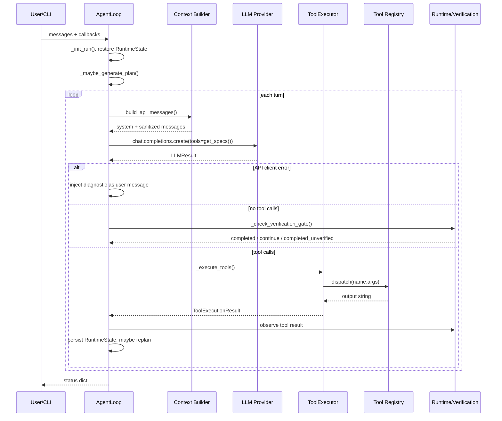
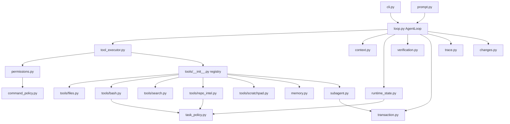
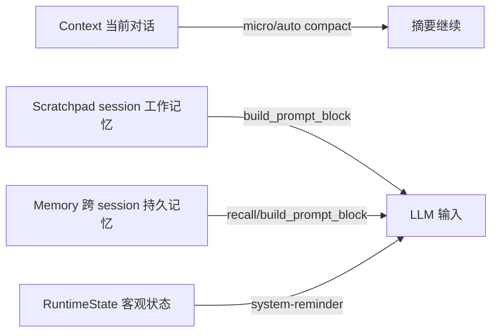
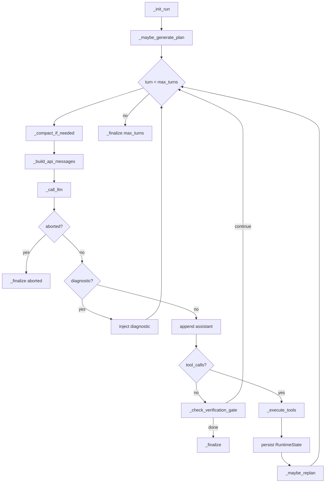
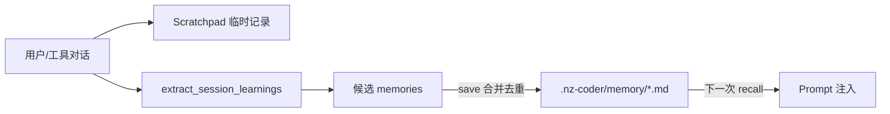

# NZ-Coder Agent Runtime 架构学习文档

> 本文基于当前源码生成，目标是解释 NZ-Coder 为什么这样设计，而不是罗列 API。代码引用格式使用 `文件::符号名`，后续代码变动后可用 `rg -n` 重新核对行号。本文对应 `doc_generation_prompt.md` 的结构要求。

---

## 第一部分：全局架构总览

### 1. 系统定位

NZ-Coder 是一个从零实现的终端 Coding Agent，对标 Claude Code、Cursor Agent、Aider 这一类工具。它不是普通聊天机器人，也不是 LangChain/LlamaIndex 这类 Agent 框架上的二次封装，而是一个手写 runtime：模型负责判断下一步，runtime 负责把判断转成工具执行、权限检查、事务回滚、验证、状态注入和 trace。

项目有两个核心使用场景：

- SWE-bench Lite：给定真实开源 issue，在仓库中定位 bug，做最小 patch，并用低噪音验证证明 patch 至少语法/编译层面成立。
- 交互式开发：用户在终端中多轮要求修 bug、加功能、写测试、解释设计或重构，agent 能在同一个工作区里持续行动。

类比一下：LLM 像驾驶员，`AgentLoop` 像驾驶舱，工具系统像方向盘和踏板，`RuntimeState` 像仪表盘，`PermissionManager` 像交通规则和限速器，`VerificationManager` 像到站前的安全检查。一个可用 coding agent 的关键不是“模型会说代码”，而是 runtime 能持续感知工作区、限制危险动作、记录状态、在错误后恢复。

### 2. 核心循环

一次用户请求进入 `nz_coder/loop.py::AgentLoop.run` 后，大致流程如下：



它仍然是 ReAct 的骨架：模型推理后选择 action，工具结果再回到模型。但 NZ-Coder 在 ReAct 外面加了工程化护栏：planning/replanning、state-as-message、verification gate、事务、权限、trace 和 context compaction。也就是说，它不是“模型自己一直想”，而是 runtime 每轮把客观事实重新摆到模型面前。

### 3. 模块地图



| 模块 | 一句话定位 |
|---|---|
| `loop.py` | Agent 主循环，负责调度上下文、LLM、工具、验证和退出路径。 |
| `tool_executor.py` | 单个 tool call 的 JSON 解析、权限检查、dispatch 和结果分类。 |
| `tools/__init__.py` | 工具注册表，工具模块通过副作用 import 调用 `register()`。 |
| `permissions.py` | deny → mode → allow → ask 的权限管线。 |
| `command_policy.py` | bash 命令 dangerous/mutating/read-only 分类。 |
| `context.py` | token 估算、micro compact、大输出落盘、auto compact。 |
| `runtime_state.py` | 运行时客观状态，按 state-as-message 注入模型。 |
| `memory.py` | 跨 session 持久记忆，负责 recall、保存、合并、prompt 注入。 |
| `tools/scratchpad.py` | session 内工作记忆，保存假设、失败、发现和 plan。 |
| `tools/repo_intel.py` | 高信号仓库工具：diff、验证、符号读取、智能搜索、调用者查找。 |
| `subagent.py` | 隔离上下文的子 agent。 |
| `verification.py` | 写后验证状态和 verification gate。 |
| `task_policy.py` | 语言无关的任务模式、文件分类、测试命令分类。 |
| `transaction.py` | 多文件写入事务，失败时恢复备份。 |
| `changes.py` | Agent-authored diff/revert 变更追踪。 |
| `trace.py` | JSONL 运行事件记录。 |
| `recovery.py` | API 重试、工具失败诊断、验证失败摘要。 |

### 4. 三层记忆架构



| 层 | 代码 | 生命周期 | 存储位置 | 注入方式 | 解决的问题 |
|---|---|---|---|---|---|
| Scratchpad | `tools/scratchpad.py::Scratchpad` | 单次 run/session | 内存 | `Scratchpad.build_prompt_block()` | 防止同一任务重复失败、遗忘计划。 |
| Memory | `memory.py::MemoryManager` | 跨 session | `.nz-coder/memory/*.md` | `MemoryManager.build_prompt_block()` | 保存用户偏好、项目事实、重复反馈。 |
| Context | `context.py` + `messages` | 当前对话 | messages / transcripts | API messages | 保存完整交互，但可压缩。 |

Scratchpad 像桌面便签，Memory 像团队 Wiki，Context 像会议记录，RuntimeState 像仪表盘。便签可以写“我怀疑 A”，Wiki 应只写稳定事实，会议记录可以很长但需要归档，仪表盘必须每轮准确。

### 5. 关键设计原则

- **state-as-message**：状态不靠模型自己记，而是 `RuntimeState.build_prompt_block()` 每轮注入。没有它，模型容易忘记已经有 diff、已经验证失败或只剩几轮。
- **graceful degradation**：planning、LLM memory extract、LLM rerank 都是增强项，失败不阻断主任务。
- **deny-first security**：`PermissionManager.check()` 先看 deny 和 dangerous bash，再看 allow。安全像门禁，黑名单优先于通行证。
- **读并发、写串行**：`_execute_concurrent()` 只在全读工具时并发；写工具共享文件系统、事务和 change tracker，必须串行。
- **低噪音验证**：`verify_changed_files()` 优先 py_compile/typecheck/go compile/cargo check，而不是无差别全量测试。
- **隔离优先的 subagent**：子 agent 不共享父 messages，减少父上下文噪音，只接收父 RuntimeState/scratchpad 摘要。
- **无框架、可测试**：核心都是普通 Python 类和函数，可以用 Fake client 测试，不依赖 Agent 框架。

---

## 第二部分：逐模块深度解说

### A. `loop.py` — Agent 主循环

#### 解决什么问题

`loop.py` 把 LLM 从“回答文本”变成“能行动的 agent”。模型返回 tool calls 后，loop 要负责权限检查、工具执行、追加 tool result、判断是否继续、验证是否通过、出错是否重试。没有这个 loop，模型最多只能给建议，不能可靠地读写仓库。

#### 核心设计思路

当前 `AgentLoop.run()` 是瘦循环，主要调用 `_init_run()`、`_compact_if_needed()`、`_build_api_messages()`、`_call_llm()`、`_check_verification_gate()`、`_execute_tools()`、`_finalize()`。拆分前的一个大方法把 15 个关注点混在一起；拆分后像机场调度塔，只负责安排流程，安检、登机、维修、日志分别由专业模块完成。

关键代码：

- `loop.py::LLMResult`：用 dataclass 表达正常结果、客户端错误诊断、不可恢复 abort。
- `loop.py::AgentLoop.run`：主循环骨架。
- `loop.py::_init_run`：reset、恢复 RuntimeState、解析 turn budget、clear scratchpad。
- `loop.py::_build_api_messages`：构建 stable system 和 dynamic context。
- `loop.py::_execute_tools`：执行工具并观察结果。
- `loop.py::_finalize`：统一退出。
- `loop.py::_sanitize_messages`：API 消息兼容性清洗。

#### 关键实现细节

`_build_context_layers()` 把 `system_prompt + memory_block` 放在 stable system，把 `state_block + scratch_block` 作为 dynamic context 注入首条 user 消息。这样 system prompt 前缀不因 turn count、scratchpad 变化而每轮变动，更利于 prompt caching。类比：公司章程和团队 Wiki 不该每分钟改，今日仪表盘可以贴在当天会议纪要前。

预算守卫通过 `SYSTEM_CONTEXT_BUDGET_TOKENS` 限制 system 相关上下文总量。超过预算时先截 scratch，再截 memory，最后才截 state。因为 scratch 是主观、可重建、最容易膨胀；state 是客观安全信号，价值最高。

工具执行策略是读并发、写串行。`_dispatch_tool_calls()` 只有在本批没有写工具且不含 `task` 时才调用 `_execute_concurrent()`，最多 4 个线程。写工具如果并发，会让事务、变更追踪和文件状态难以保证一致。

四个退出路径都进入 `_finalize()`：`completed`、`completed_unverified`、`max_turns`、`aborted`。这样保存 learnings、persist runtime state、trace run_end 不会分散在多个 return 分支里。

API 错误分流：`_is_client_error()` 识别 400/422/invalid_request_error 后注入诊断，让模型修正工具参数；5xx/超时走 `RecoveryState` backoff。客户端错误通常是请求格式错，重试同一个 payload 没意义。

`_sanitize_messages()` 做六类清洗：剥离 provider 不支持字段、填 assistant 空 content、过滤纯空 assistant、合并连续 user、剥离孤立 tool result、处理内部 timestamp。它像出境安检，不改变目的地，但保证请求格式能上飞机。

#### 模块交互

`AgentLoop.__init__()` 创建 `PermissionManager`、`RecoveryState`、`TransactionManager`、`TraceRecorder`、`ChangeTracker`、`VerificationManager` 和 `ToolExecutor`。它通过 `tools.files.set_txn_manager()` 和 `set_change_tracker()` 做依赖注入，避免文件工具自己持有不可替换的全局事务对象。

#### 取舍与局限

- `config.BLOCK_BROAD_TESTS` 是全局可变状态，多 AgentLoop 并发会相互影响。
- `_is_client_error()` 的字符串 fallback 可能误判包含 “400” 的非客户端错误。
- planning/replan 当前没有结构化输出校验。

### B. `runtime_state.py` — 运行时状态跟踪

#### 解决什么问题

长任务里，模型可能忘记自己有没有改文件、跑没跑验证、剩多少轮、是不是已经空转。`RuntimeState` 记录这些客观事实，并以 `<system-reminder>` 形式注入模型。

#### 核心设计思路

`RuntimeState` 是 state-as-message。它不存“我觉得 bug 在 X”这种主观推理，那属于 Scratchpad；它只存可观察事实：turn、diff、changed files、tests_modified、verification_attempts、env_noise_seen、task_mode、wants_tests、plan_text 等。

关键代码：

- `runtime_state.py::RuntimeState`：状态 dataclass。
- `runtime_state.py::reset`：每次 run 初始化。
- `runtime_state.py::set_acceptance_criteria_from_text`：提取任务模式和验收标准。
- `runtime_state.py::task_complexity`：L0-L3 分级。
- `runtime_state.py::observe_tool`：根据工具结果更新状态。
- `runtime_state.py::build_prompt_block`：生成 reminder。
- `runtime_state.py::save/load/restore`：JSON 持久化。
- `runtime_state.py::extract_acceptance_criteria`：启发式 L1 验收标准。

#### 关键实现细节

`task_complexity()` 用 diff/edit 规模分 L0-L3：无编辑是 L0；一次小改是 L1；几文件中等改是 L2；更大是 L3。这不是学术分类，而是流程控制：L1 可以少提醒，L3 要更强调验证和收敛。

空转检测通过 `turn_count - last_edit_turn`。但 `task_mode == "discuss"` 时不催促编辑，因为讨论方案时没有编辑是正常行为。这个设计把 SWE-bench 的“必须尽快 patch”策略扩展为通用 coding agent 的多模式策略。

`observe_tool()` 解析 `diff_status` 的文本输出，而不是直接拿 dict。原因是工具协议统一返回字符串，既给模型看，也给 CLI 展示。代价是 `_parse_changed_files()` 对输出格式敏感。

持久化使用 JSON 而不是 pickle，因为 JSON 可读、可审计、跨版本更安全。`restore()` 只恢复当前类已有字段，旧版本多余字段会被跳过。

#### 模块交互

`AgentLoop` 每轮设置 `runtime_state.turn_count`，工具执行后调用 `observe_tool()`，构建上下文时调用 `build_prompt_block()`。`subagent.py::_parent_context_block()` 读取 `.nz-coder/runtime_state.json`，把父 agent 的关键状态传给子 agent。

#### 取舍与局限

- `extract_acceptance_criteria()` 是启发式，短句如 “Fix timezone-aware datetime comparison bug” 可能提不出标准。
- `observe_tool()` 与 `diff_status` 文本格式耦合。
- 环境噪音模式可能误判真实项目 import 错误。

### C. `context.py` — 上下文压缩

#### 解决什么问题

工具输出可能非常大，尤其 grep、测试日志、traceback。如果全部塞进 messages，请求会越来越贵，甚至超过上下文窗口。`context.py` 提供三种压缩：大输出落盘、micro compact、auto compact。

关键代码：

- `context.py::estimate_tokens`：ASCII/CJK token 估算。
- `context.py::persist_large_output`：超 30000 字符输出写入 `.nz-coder/tool-results/`。
- `context.py::micro_compact`：压缩旧 tool result。
- `context.py::_try_time_based_compact`：空闲 30 分钟后清旧结果。
- `context.py::auto_compact`：LLM 摘要并写 transcript。

#### 关键实现细节

`estimate_tokens()` 对 ASCII 用 `//4`，非 ASCII 按 1 字/token。这修复了中文 JSON 估算偏大的问题。类比英文四个字母一拍，中文一个字就是一拍。

`micro_compact()` 保护最近 N 条和含 traceback/FAILURES 的结果，然后按大小降序压缩旧结果。为什么按大小？压缩 50KB 输出比压缩 500B 输出收益大得多。

`persist_large_output()` 超阈值时只把 preview 放上下文，并告诉模型完整输出路径。这样用户如果说“看完整 traceback”，模型仍可 `read_file` 那个落盘路径。

`auto_compact()` 会把原始 transcript 写到 `.nz-coder/transcripts/`，再用最近 80000 字符做摘要，并附上 `git diff --stat`。diff stat 很重要，因为摘要如果漏掉已改文件，后续 agent 可能重复改或忘记验证。

#### 取舍与局限

- auto compact 质量依赖 LLM，可能漏关键信息。
- 30 分钟 time-based compact 假设 provider cache TTL 较长，不同 provider 需要不同阈值。
- 大输出落盘后模型只看 preview，必须主动读完整文件。

### D. `memory.py` — 持久化记忆

#### 解决什么问题

跨 session 的用户偏好和项目事实不能靠当前 messages 保存。`memory.py` 把这些事实保存为 markdown 文件，并在后续任务按相关性注入。没有它，用户每次都要重复“这个项目用 Poetry”“不要用 async view”。

关键代码：

- `memory.py::MemoryManager`。
- `memory.py::recall`：多信号召回。
- `memory.py::build_prompt_block`：用户偏好优先注入。
- `memory.py::save`：保存和去重合并。
- `memory.py::_find_merge_target` / `_merge_memory`。
- `memory.py::extract_session_learnings`：规则 + LLM 提取。
- `memory.py::_tokenize`：代码感知 token。
- `memory.py::_relevance_score`：coverage/jaccard/exact/freshness。
- `memory.py::rerank_memories`：可选 LLM rerank。

#### 关键实现细节

`recall()` 的分数为 coverage 0.55 + jaccard 0.20 + exact 0.15 + freshness 0.10。coverage 权重大，因为 coding query 通常短，query 里的符号、路径、错误词是否被覆盖比整体集合相似更重要。freshness 只做微调，避免最近访问但无关的 memory 顶上来。

`_tokenize()` 会拆 snake_case、camelCase、路径片段，做轻量词干和别名。例如 `parse_http_date` 会拆成 `parse`、`http`、`date`、`parse_http`、`http_date` 等，能把“HTTP 日期解析 bug”和 `parse_http_date timezone handling` 关联起来。

`save()` 会先检查同名更新，再用 `_find_merge_target()` 找近重复。`_memory_similarity()` 使用 Jaccard 和 min coverage 的最大值，但加了 `_SIMILARITY_MIN_TOKENS_FOR_MERGE=5`，避免超短记忆“use pytest”误触发 1.0 相似度。

`build_prompt_block()` 始终优先放最多 3 条 `user` 类型 memory。用户偏好像操作系统默认设置，不一定和当前 query 有词面重合，但应该稳定存在；当然当前用户消息仍然优先。

`extract_session_learnings()` 默认规则提取：显式 remember/note/记住，以及重复失败。开启 `MEMORY_LLM_EXTRACT` 后会用 LLM 抽取隐式长期事实，并请求 JSON mode；不支持时 fallback。

#### 取舍与局限

- 不是向量库，语义召回依赖代码 token 和可选 LLM rerank。
- `cleanup()` 有实现但没有自动调度或注册工具。
- LLM 提取失败会静默回退，trace 粒度还可更细。

### E. `tools/scratchpad.py` — Session 内工作记忆

#### 解决什么问题

同一任务里，agent 可能几轮后忘记已经试过的错误路径。Scratchpad 是短期便签，记录 hypothesis、attempt、failure、finding、plan。

关键代码：

- `scratchpad.py::CATEGORIES`。
- `scratchpad.py::Scratchpad.update`。
- `scratchpad.py::Scratchpad.replace_category`。
- `scratchpad.py::Scratchpad.build_prompt_block`。
- `scratchpad.py::Scratchpad.clear`。

#### 关键实现细节

普通条目最多 500 字符，plan 最多 2000 字符，总条目最多 20。`build_prompt_block()` 总预算 2000 字符，其中 plan 有 1200 字符优先预算，再倒序选择最新其他条目。这样 plan 不会被失败日志挤掉，失败日志也不会无限膨胀。

`replace_category()` 主要服务 plan/replan。直接 update 会让旧 plan、新 plan、replan 同时出现，模型可能不知道听哪个。replace 保证当前只有一个 plan。

Scratchpad 每次 run 开始 clear，不持久化。因为里面是临时推理，不应污染下个任务；稳定事实应进入 Memory。

#### 取舍与局限

- 当前 scratchpad 是模块级全局实例，多 AgentLoop 并发会共享。
- 没有任务 ID 隔离，适合本地单用户串行使用。

### F. `permissions.py` — 权限系统

#### 解决什么问题

Coding Agent 能执行 shell 和写文件，权限系统是安全边界。没有它，模型可能误执行危险命令、污染环境或写错文件。

关键代码：

- `permissions.py::PermissionManager.check`。
- `permissions.py::PermissionRule.matches`。
- `permissions.py::ask_user`。
- `command_policy.py::classify_bash`。
- `command_policy.py::is_known_read_only_command`。

#### 核心设计

权限管线是 deny → bash classification/mode → safe read allow → allow rules → ask rules → mode fallback。deny 最高优先级，因为安全规则不应被后面的 allow 覆盖。

四种模式：

- `default`：读工具自动允许，写工具和未知/mutating bash 询问。
- `auto`：大多自动允许，但 dangerous bash 仍阻止。
- `plan`：写操作阻止，只允许读和只读 shell。
- `acceptEdits`：允许文件编辑，但 bash 仍按风险判断。

`classify_bash()` 区分 dangerous 和 mutating。`sudo apt-get install` dangerous，因为涉及系统权限；`pip install` mutating，因为改环境，默认还受 `ALLOW_BASH_PACKAGE_INSTALLS` 控制。

#### 取舍与局限

- prefix allow 粒度粗，`bash(prefix:git )` 会允许 `git push --force`。
- read-only 白名单保守，`python3 -c 'print(1)'` 不算 read-only，因为 Python 可执行任意代码。

### G. `tools/repo_intel.py` — 仓库智能工具集

#### 解决什么问题

基础 grep/read_file 太低层。Repo intel 工具把常见探索动作结构化，减少盲目搜索。

五个工具：

- `diff_status()`：当前 diff、文件、语言、测试文件、下一步建议。
- `verify_changed_files()`：对改动源码做低噪音检查。
- `read_symbol()`：AST 读取/列出 Python 符号。
- `smart_search()`：从 issue/test/traceback 抽 token，grep-first 后 TF-IDF 排名。
- `find_symbol_callers()`：AST 查 Python 符号引用。

#### 关键实现细节

`smart_search()` 先用 `git grep -l` 对 top 5 token 找候选文件，再读候选做精排。评分用 `log1p(count) * idf * file_weight`，避免大文件因重复出现 token 线性膨胀。AST parse 缓存在 `parsed_trees`，评分和摘要复用，避免重复 parse。

`read_symbol()` 的 `_collect_symbols(tree, max_depth=40)` 递归收集嵌套类、方法和内部函数，深度上限防止极端生成代码触发递归问题。

`verify_changed_files()` 已从 Python-only 扩展到多语言：Python 用 py_compile，JS/TS 用 `npm run typecheck` 或本地 `tsc --noEmit`，Go 用 `go test <pkg> -run '^$'` 做包编译检查，Rust 用 `cargo check`。找不到 checker 返回 WARN，避免通用项目卡死在 gate。

`find_symbol_callers()` 用 NodeVisitor 控制遍历。旧的 `ast.walk` 会让 `obj.foo()` 同时匹配 Call 和 Attribute，同一行重复；现在 call 优先，`visit_Call()` 不再访问 func，只访问 args/keywords。

#### 取舍与局限

- `smart_search` include 支持非 Python，但 AST summary 只对 Python 有效。
- Go 的 `go test -run '^$'` 不跑普通测试函数，但仍可能执行 init 或编译测试文件；不是完全等价于 py_compile。
- `diff_status` 是文本工具，RuntimeState 解析依赖格式稳定。

### H. `subagent.py` — 子 Agent

#### 解决什么问题

父 agent 长对话会有大量噪音。子 agent 用 fresh messages 和有限工具集处理子任务，只返回摘要，重点是隔离上下文。

关键代码：

- `subagent.py::_completion_with_timeout`。
- `subagent.py::_subagent_tools`。
- `subagent.py::_parent_context_block`。
- `subagent.py::_run_allowed_tool`。
- `subagent.py::run_subagent`。

#### 关键实现细节

工具集分层：explore/review 只读；test 可跑 bash 检查但不写；general 可写并可调用 verify_changed_files。工具 specs 从共享 registry 取，所以子 agent 可以用 `smart_search/read_symbol/find_symbol_callers/diff_status`。

父子上下文传递通过 `_parent_context_block()`：读取 `.nz-coder/runtime_state.json` 和父 scratchpad 前 2000 字符。它不会复制父 messages，因为复制会把父 agent 的十几轮试错噪音带过去。类比请外部专家会诊：给病历摘要和关键检查结果，不给整段会议录音。

超时保护有两层：主线程用 SIGALRM；非主线程或不支持信号时用 ThreadPoolExecutor future timeout。子 agent 还有总 deadline 和 max_turns。

general 模式如果写了文件，结束前自动跑 verify_changed_files；失败则 rollback 子 agent 独立事务。

#### 取舍与局限

- test 模式当前没有直接暴露 verify_changed_files，只能通过 bash 做检查。
- `.nz-coder/subagent-scratch/` 没有自动清理。
- 父子并发改同一文件没有锁，当前默认串行。

### I. `verification.py` — 验证状态管理

#### 解决什么问题

模型写完代码可能直接说“完成”。`VerificationManager` 是提交前审稿：只要写过实质文件且没有通过验证，就在模型无工具响应时拦住它。

关键代码：

- `verification.py::mark_write`。
- `verification.py::observe_bash`。
- `verification.py::observe_verify_changed_files`。
- `verification.py::should_gate`。
- `verification.py::make_gate_message`。
- `verification.py::_is_verification_command`。
- `verification.py::_is_env_import_error`。
- `verification.py::_is_scratch_file_write`。

#### 关键实现细节

`mark_write()` 对真正写代码的工具设置 `_needed=True`，但根目录 scratch 文档和临时测试文件不触发 gate。`observe_bash()` 判断命令是否像验证命令，再根据退出码和失败输出更新 gate。环境噪音如缺依赖、显示后端问题、pytest 配置错误会被跳过，避免覆盖已有的低噪音通过结果。

`observe_verify_changed_files()` 把 OK 视为 passed，把 WARN 视为 skipped 但允许结束。通用 coding agent 里很多项目没有 typecheck 脚本，WARN 继续 gate 会导致无法收工。

#### 取舍与局限

- `_is_verification_command()` 是启发式，可能漏掉项目自定义 checker。
- 环境噪音过滤保守但仍可能误判。

### J. `task_policy.py` — 任务策略

#### 解决什么问题

早期策略偏 SWE-bench/Python。`task_policy.py` 把语言、测试文件、任务模式、测试命令范围抽成共享规则，供 runtime、bash、repo_intel 复用。

关键代码：

- `task_policy.py::language_for_path`。
- `task_policy.py::is_source_file`。
- `task_policy.py::is_test_file`。
- `task_policy.py::detect_task_mode`。
- `task_policy.py::task_wants_tests`。
- `task_policy.py::estimate_text_complexity`。
- `task_policy.py::is_exact_test_command`。
- `task_policy.py::is_broad_test_command`。

`detect_task_mode()` 优先级是 test > refactor > feature > bugfix > discuss > general。例如 “add a test for login endpoint” 同时命中 test 和 feature，但测试意图更具体，所以返回 test。

`estimate_text_complexity()` 在 planning 前使用，因为那时还没有 diff/edit。它看文件引用、列表结构、then/finally、文本长度、多文件/迁移关键词，返回 simple/moderate/complex。

#### 取舍与局限

- 短但大的任务如“重构 auth 模块”可能被低估。
- 文件语言覆盖常见语言，但没有框架级策略。

### K. Planning + Replanning — 规划层

#### 解决什么问题

纯 ReAct 容易“走一步看一步”。复杂 feature/refactor/test 需要先拆路线；如果中途空转或验证失败，还需要重新规划。

关键代码：

- `config.py::PLANNING_ENABLED`，默认关闭。
- `loop.py::_maybe_generate_plan`。
- `loop.py::_call_planning_llm`。
- `loop.py::_should_replan`。
- `loop.py::_maybe_replan`。
- `loop.py::_call_replan_llm`。
- `scratchpad.py::replace_category`。
- `runtime_state.py` 的 `plan_generated/plan_text/replan_count/initial_plan_complexity` 字段。

planning 触发条件是 task_mode 在 feature/refactor/test，或文本复杂度 moderate/complex。Bugfix 默认不触发，因为很多 bugfix 需要先搜索定位，过早规划容易编故事；复杂 bugfix 仍可能因文本复杂度触发。

plan prompt 限制最多 5 步，并要求最后一步 verification。这是 prompt-level 约束，代码不强制校验。失败不阻断主流程，只写 trace。

replan 三个触发：连续无编辑、验证多次失败、实际 diff 复杂度比初始预估高。恢复时 `_init_run()` 会把 RuntimeState 的 `plan_text` hydrate 回 scratchpad，因为 scratchpad 不持久化。

#### 取舍与局限

- plan/replan 没有 structured output 校验。
- simple/moderate/complex 和 L0-L3 是两套量纲，当前只是启发式映射。
- 默认关闭保证测试兼容和成本可控。

---

## 第三部分：数据流与生命周期

### 1. 一次完整 run() 的时序图



### 2. 上下文注入流程

```text
system_prompt + memory_block        -> stable_system
state_block + scratch_block         -> dynamic_context
messages                            -> _sanitize_messages
first user message gets context     -> _inject_dynamic_context
[system stable_system] + messages   -> API request
```

固定层是 `system_prompt` 和工具规格，半固定层是 memory，任务层是 scratchpad/plan，动态层是 messages/tool results/RuntimeState。分层的核心目的是预算和缓存：稳定前缀不要频繁变，动态状态不要膨胀 system。

### 3. 工具调用生命周期

```text
LLM tool_calls
  -> ToolExecutor.execute_one
     -> JSON parse
     -> PermissionManager.check
     -> dispatch(name,args)
     -> ToolExecutionResult
  -> AgentLoop._record_tool_result
     -> VerificationManager observe
     -> RuntimeState observe
     -> Scratchpad failure note
     -> TraceRecorder log
  -> persist_large_output
  -> append role=tool message
```

`dispatch_failed` 表示工具本身失败或被拒绝；`command_failed` 表示 bash 命令非零退出。测试失败通常是 `command_failed`，不触发事务 rollback，因为它是修复反馈。

### 4. 记忆生命周期



记忆系统的目标不是保存越多越好，而是保存稳定、跨任务有用、不会污染未来判断的事实。

### 5. 中断恢复流程

如果 agent 在 assistant tool_calls 后、tool result 追加前被中断，下次 `_inject_missing_tool_results()` 会为缺失 tool call 注入 `<interrupted>` 合成结果，修复 API 消息合法性。随后 `_init_run()` 从 `.nz-coder/runtime_state.json` 恢复 active 状态，并把 `plan_text` hydrate 回 scratchpad。文件系统已经写入的内容不会因进程 SIGKILL 自动回滚，需要后续 `diff_status` 重新感知。

---

## 第四部分：设计决策速查表

| 决策 | 选择 | 替代方案 | 选择原因 |
|---|---|---|---|
| Agent 编排 | 手写 `AgentLoop` | LangChain/LangGraph | 机制透明、可测试、符合项目展示目标。 |
| 主循环 | ReAct + planning/replan | 纯 planner-executor | 保留工具反馈驱动，同时能处理复杂任务。 |
| run 结构 | 瘦循环 + helpers | 250 行大方法 | 单一职责，新增状态逻辑更容易。 |
| LLM 返回 | `LLMResult` dataclass | tuple | 语义清楚，避免长度判断。 |
| 上下文分层 | stable system + dynamic user | 全拼 system | 提升 prompt caching，降低动态扰动。 |
| 系统预算 | `SYSTEM_CONTEXT_BUDGET_TOKENS` | 只看 messages 总量 | 防止 memory/scratch/state 膨胀。 |
| 大输出 | 落盘 + preview | 全塞上下文 | 保留可追溯性，节省 token。 |
| micro compact | 压缩最大旧结果 | 简单删最旧 | 最大化收益，保留最近信息。 |
| auto compact | LLM 摘要 + transcript | 直接截断 | 保留连续性和审计记录。 |
| RuntimeState | state-as-message | 模型自记状态 | 客观、可恢复、可测试。 |
| 持久化格式 | JSON | pickle | 可读、跨版本、安全。 |
| Scratchpad | 不持久化 | 跨 session 保存 | 避免临时猜测污染未来任务。 |
| Memory 检索 | 代码 token 多信号 | 向量数据库 | 零依赖，符号/路径匹配强。 |
| Memory 合并 | 相似阈值 + 最小 token | 永远追加 | 防重复事实膨胀。 |
| 用户偏好 | user memory 前 3 slot | 全按相关性 | 偏好是稳定默认。 |
| 权限策略 | deny-first | allow-first | 安全规则必须优先。 |
| bash 分类 | dangerous/mutating/read-only | 全询问或全允许 | 平衡安全和效率。 |
| 事务 | 批次 begin/commit/rollback | 单文件写 | 多文件失败保持一致。 |
| bash 非零 | 不 rollback | 视为工具失败 | 测试失败是修复反馈。 |
| 验证 gate | 写后必须验证 | 模型说完成就完成 | 提高 patch 可信度。 |
| WARN 验证 | 允许结束 | 一直 gate | 通用项目可能无 checker。 |
| 搜索评分 | grep-first + TF-IDF | 全仓逐行计数 | 快，避免大文件膨胀。 |
| 子 agent | 独立上下文 | 共享父 messages | 隔离探索噪音。 |
| planning 默认 | 关闭 | 默认开启 | 测试兼容、成本可控。 |
| Go 验证 | `go test pkg -run '^$'` | `go test ./...` | 降低执行测试噪音。 |

---

## 第五部分：术语表

| 术语 | 定义 |
|---|---|
| Agent Loop | 模型调用、工具执行、结果回灌的主循环。 |
| ReAct | Reasoning + Acting，边推理边行动的 agent 范式。 |
| Planning | 复杂任务开始前生成执行计划。 |
| Replanning | 空转、验证失败或复杂度升级后修订计划。 |
| state-as-message | 把运行状态以消息形式注入给模型。 |
| RuntimeState | 系统自动维护的客观运行状态。 |
| Scratchpad | 当前 session 的短期推理便签。 |
| Memory | 跨 session 的持久化记忆。 |
| Context | 当前对话历史和工具输出。 |
| Stable system | 不频繁变化的 system prompt 前缀。 |
| Dynamic context | 每轮变化的状态/工作记忆注入。 |
| Prompt caching | provider 对相同 prompt 前缀复用缓存。 |
| micro_compact | 对旧工具结果做轻量占位压缩。 |
| auto_compact | 用 LLM 摘要长对话并重建 continuation message。 |
| persisted-output | 大工具输出落盘后的预览块。 |
| verification gate | 写文件后未验证时阻止结束的闸门。 |
| broad test | 大范围测试命令，如 `pytest`、`npm test`。 |
| exact test | 聚焦到文件/测试名/过滤器的窄测试。 |
| env noise | 缺依赖、显示后端、连接失败等环境问题。 |
| dispatch_failed | 工具解析、权限或 handler 层失败。 |
| command_failed | bash 命令非零退出。 |
| hydrate | 从持久状态恢复内存态内容。 |
| acceptance_criteria | 从用户任务中提取的验收标准。 |
| task_mode | bugfix/feature/refactor/test/discuss/general 等任务模式。 |
| TF-IDF | 搜索中降低常见词、提升稀有词的评分方法。 |
| file_weight | smart_search 对不同文件类型的权重调整。 |
| TransactionManager | 写前备份、失败恢复的事务管理器。 |
| ChangeTracker | 记录 agent 修改前后 diff 的模块。 |
| TraceRecorder | 写 JSONL 运行事件的追踪器。 |
| Subagent | 独立上下文和工具权限的子 agent。 |
