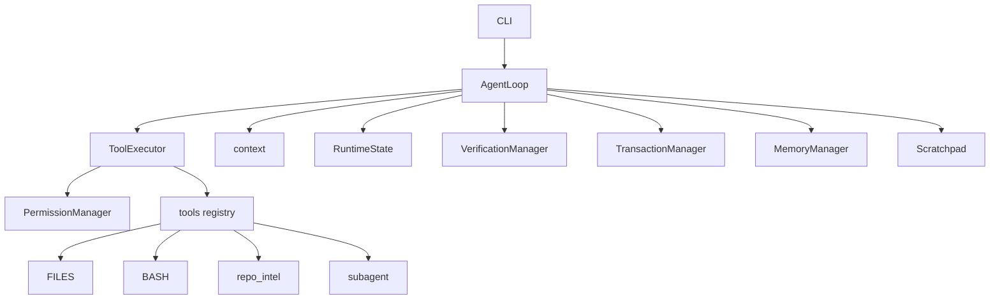

# NZ-Coder 深度面试题参考答案

> 本文按 `interview_questions.md` 逐题回答，答案基于当前源码实现。回答会明确区分“已经实现”和“未来可改进”，避免把理想设计说成现状。

---

## 一、架构总览

### 1.1 请用一句话描述 nz_coder 的定位，然后画出核心模块的依赖关系图。

NZ-Coder 是一个从零实现的本地终端 Coding Agent runtime，用 OpenAI-compatible function calling 驱动工具调用，重点能力是安全写文件、可验证修复、上下文压缩、记忆和 SWE-bench 评测。

依赖注入主要是 `AgentLoop.__init__()` 把 `TransactionManager` 和 `ChangeTracker` 注入 `tools/files.py`。模块级全局包括工具 registry、`memory_mgr`、`scratchpad`。没有统一成一种方式，是因为文件写入需要事务隔离和测试替换；工具注册和记忆/便签当前按单用户本地 runtime 设计，使用全局更简单，但这是未来并发化的技术债。

### 1.2 你的 agent 主循环是什么范式？跟经典 ReAct 的区别在哪里？

主循环是 ReAct：模型决定 action，runtime 执行工具，tool result 回到模型，再继续。区别是 NZ-Coder 在 ReAct 外面加了 planning/replanning、RuntimeState、verification gate 和事务权限。加 planning 后仍算 ReAct，只是更准确叫 “ReAct with explicit planning and runtime state feedback”，不是纯 planner-executor。

### 1.3 解释三层记忆架构。

Scratchpad 是 session 内工作记忆，保存假设、失败、发现、plan；Memory 是跨 session 持久记忆，保存用户偏好和项目事实；Context 是当前对话 messages 和工具结果。Scratchpad 不持久化，因为它包含临时猜测和失败尝试，跨任务保存会污染后续判断。稳定事实应经过 `extract_session_learnings()` 进入 Memory。

### 1.4 什么是 state-as-message？你的系统里哪些地方用了这个模式？

state-as-message 是把客观状态转成 prompt 注入。实现点是 `RuntimeState.build_prompt_block()`、`_build_context_layers()` 和 `_inject_dynamic_context()`。如果不注入 RuntimeState，模型需要从几十轮历史里自己推断是否有 diff、是否验证过、是否空转，长任务里很容易忘记验证或重复搜索。SWE-bench 具体掉分没有量化实验，但会明显增加“有 patch 未验证”和“轮次耗尽”。

### 1.5 你的系统有几种退出状态？

`completed`、`completed_unverified`、`max_turns`、`aborted`。`completed` 是模型无 tool_calls 且 verification gate 不需要拦截；`completed_unverified` 是写后仍未验证，但 gate 提示次数超过 `MAX_VERIFICATION_GATE_PROMPTS`；`max_turns` 是循环耗尽；`aborted` 是 API 连续错误超过 `RecoveryState.max_retries`。

### 1.6 上下文四层成本模型对应什么？

固定层：`system_prompt` 和工具定义；半固定层：`memory_block`；任务层：scratchpad/plan；动态层：messages、tool results、RuntimeState。`memory_block` 放 stable system 是为了 prompt caching；`state_block/scratch_block` 每轮变化，放 dynamic context 避免破坏 system 前缀。

### 1.7 平均 token 消耗和优化方向。

项目没有固定“平均任务 token”统计，只在 trace 的 `llm_request.token_estimate` 记录估算。最大来源通常是工具输出，尤其 grep/test output。要降 50%，优先减少大 grep、使用 `smart_search/read_symbol`、更激进 `persist_large_output` preview 和 micro compact。

### 1.8 支持哪些 LLM provider？

支持 OpenAI SDK 兼容 provider，通过 `API_BASE_URL/API_KEY/MODEL_ID` 切换。`reasoning_content` 是部分 provider 的扩展字段，`_sanitize_messages()` 用 `PASS_REASONING_CONTENT` 控制是否保留；不支持该字段的 provider 会因额外字段报 400。

### 1.9 工具调用生命周期。

LLM 返回 tool_calls 后，`AgentLoop._execute_tools()` 调 `ToolExecutor.execute_one()`。后者解析 JSON、权限检查、dispatch，返回 `ToolExecutionResult`。loop 再更新 verification/runtime/scratchpad/trace，必要时落盘大输出，最后追加 role=tool message。若一次返回 5 个工具且含写工具，整批串行；只有全读且不含 `task` 才并发，结果仍按原顺序插回。

### 1.10 跟 Claude Code 最大差距是什么？

最大差距是策略成熟度和产品集成。Claude Code 有更成熟的上下文策略、权限 UX、IDE/终端体验、模型协同和多场景打磨。NZ-Coder 优势是源码透明、机制可控、适合学习和实验，但并发、多租户、跨语言策略和 UX 还不成熟。

---

## 二、Agent 主循环 `loop.py`

### 2.1 run() 为什么拆成 30 行骨架？

拆分后 `run()` 只表达调度流程，初始化在 `_init_run()`，上下文在 `_build_api_messages()`，工具在 `_execute_tools()`，退出在 `_finalize()`。如果新增“工具调用后自动保存 checkpoint”，应放在 `_execute_tools()` 后或 `_record_tool_result()` 附近，不需要改 LLM 调用层。

### 2.2 `_build_context_layers` 的预算守卫。

它先估算 fixed/memory/state/scratch token，总量超过 `SYSTEM_CONTEXT_BUDGET_TOKENS` 后先截 scratch，再按剩余预算截 memory，再重算 scratch，最后截 state。不能轻易反过来，因为 state 包含验证、剩余 turn、diff 等安全信号，scratch 是主观且最可牺牲。

### 2.3 为什么动态内容放 user 而非 system？

为了保持 system prompt 前缀稳定，提升 prompt caching 命中。若对话没有 user 消息，`_inject_dynamic_context()` 会新建一条 user 消息放 dynamic context，这是防御性路径。

### 2.4 `_sanitize_messages` 哪一步最容易出 bug？

最容易出问题的是 tool_call/tool_result 配对和连续 user 合并。OpenAI 通常容忍较多格式，但 Bedrock/Anthropic 风格 provider 对连续 role、孤立 tool result 更严格；不处理会 400。

### 2.5 `_inject_missing_tool_results` 解决什么？

解决中断后留下的未回答 tool_calls。场景是 assistant tool_calls 已追加，但工具还没执行或 result 未写入就被 kill。若不修复，下一次 API 会拒绝消息序列。

### 2.6 `LLMResult` 三种状态。

正常：`content/tool_calls` 有值；客户端错误：`diagnostic` 非空；不可恢复错误：`aborted=True`。400/422 注入诊断让模型自我修正，因为坏 JSON 通常来自模型生成参数，runtime 不知道真实意图。

### 2.7 `_execute_concurrent` 策略。

仅全读工具并发，最大 4 线程。`task` 在 non-concurrent 集合里，因为它会启动子 agent，带独立 deadline/事务/上下文，并发执行容易资源争用和文件状态冲突。

### 2.8 事务何时触发？

本批工具含 `WRITE_TOOLS` 时 begin；所有工具 dispatch 成功就 commit；有 dispatch_failed 就 rollback。bash 测试失败是 `command_failed=True`，不是 dispatch_failed，因为失败测试是修复反馈，不应回滚代码。

### 2.9 `_maybe_save_learnings` 为什么只在 auto 模式？

默认模式下自动写长期记忆会让用户感觉被偷偷持久化。auto 模式表示用户接受更高自治度，适合评测或托管运行。

### 2.10 micro_compact 和 auto_compact 区别。

micro 每轮尝试，只压缩旧 tool result；auto 只在 token 超限或手动 compact 时触发，会用 LLM 摘要并重建 messages。100 轮中何时开始取决于 tool result 总 token 是否超过阈值。

### 2.11 verification gate 工作流程。

模型无工具响应时，`_check_verification_gate()` 看 `VerificationManager.should_gate()`。若需要验证且 gate 次数未超上限，注入 `make_gate_message()` 继续；超过上限则 `completed_unverified`。`MAX_VERIFICATION_GATE_PROMPTS=0` 会直接不提示验证重试。

### 2.12 `_parse_turn_budget` 支持什么？

支持 `+50k`、`+1.5m`、`use 100 turns`、`use 2k turns`、`+30 turns`。`+50k` 是 token 规模暗示，映射到 `_TOKEN_HINT_TURNS=200`，不是 50000 turns。

---

## 三、运行时状态 `runtime_state.py`

### 3.1 为什么解析 `diff_status` 文本？

工具协议统一返回字符串，便于模型和 CLI 展示，所以 RuntimeState 解析文本。边界是格式耦合：标题、缩进、字段名变化都可能让 `_parse_changed_files()` 漏解析。

### 3.2 L0-L3 阈值怎么定？

是工程启发式，没有统计训练。L1 的 1200 diff chars 大约对应几十行以内的小 patch；L2 是几文件中等修改；L3 是大改，需要更强收敛和验证提醒。

### 3.3 reminder 会冲突吗？

可能同时出现空转和低预算提醒，但不矛盾：一个描述行为风险，一个描述资源风险。风险是提醒过多稀释重点，所以只有状态有意义时才输出 block。

### 3.4 acceptance_criteria 准确率？

保守启发式，只抓测试路径、FAILED、should/must/expected/failing 和中文“应该/必须/失败”。对 “Fix timezone-aware datetimes are incorrectly compared” 可能提取不到，这是局限。

### 3.5 环境噪音覆盖哪些？

覆盖缺依赖、ImportError、显示后端、连接失败、权限、文件缺失、Qt/Tk 等。若代码真实导致 `No module named mypackage`，可能误判，因此验证模块里做得更保守，但仍不能完全避免。

### 3.6 为什么 JSON 而不是 pickle？

JSON 可读、可审计、跨版本安全。`restore()` 遇到未知字段会跳过，因为只恢复当前对象已有属性。

### 3.7 broad/exact 灰区。

`pytest tests/` 算 broad，`pytest tests/test_foo.py` 算 exact。`pytest tests/unit/` 当前多半算 broad，因为目录范围仍较大；这是保守策略。

### 3.8 wants_tests 如何影响 reminder？

如果用户明确要测试，测试文件修改会被提醒为“确保覆盖改动”，不是负面信号。`fix the bug and add a regression test` 通常 `task_mode == "test"`，`wants_tests=True`。

---

## 四、记忆系统 `memory.py` + `scratchpad.py`

### 4.1 recall 评分公式。

`0.55*coverage + 0.20*jaccard + 0.15*exact + 0.10*freshness`。freshness 降低是为避免最近访问但无关的 memory 被顶上来。

### 4.2 `_tokenize` 的代码感知。

它拆 snake/camel/path，加入 bigram、别名和词干。`parse_http_date` 会产生 `parse`、`http`、`date`、`parse_http`、`http_date` 等，比空格 split 更适合代码。

### 4.3 save 去重合并。

校验 type/name 后，若不是同名更新，就 `_find_merge_target()`：先看 normalized text，再算 `_memory_similarity()`；超过 0.72 合并。description 不同但 content 近似仍可能合并，因为相似度看完整文本。

### 4.4 为什么 user memory 前 3 个 slot？

用户偏好是稳定默认设置，不一定和当前 query 有词面重合。若有 10 条 user memory，按 `last_accessed` 最新取 3 条。

### 4.5 规则提取 vs LLM 提取。

规则捕获显式 remember/note/记住和重复失败。用户说 “this project uses Django 3.2, don't use async views” 没触发词时规则可能漏；LLM 提取可抽出项目事实和偏好。

### 4.6 LLM rerank 失败怎么降级？

`rerank_memories()` 失败返回原候选前 top_k，不报错，因为 rerank 是增强项。每次新 query 最多一次，并有 `_last_memory_query` 缓存。

### 4.7 `replace_category` 为什么存在？

Plan 应只有一个当前版本。直接 update 会留下多个互相冲突的 plan。`_MAX_PLAN_CHARS=2000` 是存储上限，prompt 自动注入只给约 1200 字符预算，多出的可通过 read_scratchpad 看。

### 4.8 为什么倒序选 other_entries？

最新失败/发现通常最相关。第 1 轮 finding 到第 15 轮能否看到取决于 2000 字符预算和 20 条上限；必要时可显式 `read_scratchpad`。

### 4.9 `_SIMILARITY_MIN_TOKENS_FOR_MERGE` 解决什么？

`max(jaccard, min_coverage)` 对短文本危险，两 token 全命中就是 1.0。最小 5 token 门槛避免 “use pytest” 这种短 memory 到处合并。

### 4.10 cleanup 谁调用？

`MemoryManager.cleanup()` 删除过期且未访问 memory，或标记 stale。当前没有注册工具，也没有自动调用；索引用 200 行和 25KB 双上限保护。

---

## 五、权限与安全

### 5.1 `check()` 决策树。

顺序：deny rules → bash dangerous/mode/allow/read-only → plan 写阻止 → safe read tools → allow rules → ask rules → auto/acceptEdits fallback → default 写询问。allow `bash` 和 deny `bash(prefix:rm)` 同时存在时，`rm -rf /` 先 deny，且 dangerous classifier 也会挡。

### 5.2 dangerous vs mutating。

dangerous 是系统级破坏或高权限，如 sudo、shutdown、mkfs、root rm；mutating 是改工作区/环境，如 cp/mv/git commit/pip install。`sudo apt-get install` dangerous，`pip install requests` mutating。

### 5.3 acceptEdits。

acceptEdits 允许文件编辑工具，但 bash 仍按风险判断。`git push origin main` 不会自动允许，需要确认或被策略拦截。

### 5.4 read-only 白名单。

包括 cat/ls/rg/grep/head/tail/wc/tree/git status/diff/log/show 等。`python3 -c 'print(1)'` 不算 read-only，因为 Python 可执行任意代码。

### 5.5 prefix matcher 风险。

`cmd.startswith(prefix)` 简单直接，但粒度粗。`bash(prefix:git )` 会允许 `git push --force`，所以不适合作为泛化安全规则。

### 5.6 p=always-prefix 的价值。

用户对同类命令可减少重复确认，例如按 p 后允许 `git ` 前缀。系统不会自动从多次 y 学习，必须用户主动选择 p。

---

## 六、仓库智能工具 `repo_intel.py`

### 6.1 smart_search 为什么 TF-IDF？

简单逐行计数会让大文件膨胀。当前用 `log1p(count)*idf*file_weight`，50 次命中不会线性拿 50 分；小文件若文件名、符号、稀有 token 命中强，能排前。

### 6.2 file_weight 怎么定？

测试 0.45、docs 0.35、examples 0.50、Python 1.20 是启发式：初始 bug 定位偏源码。若失败测试名命中，会额外加分，降低漏测试风险。

### 6.3 Go 验证选择对吗？

当前是 `go test <pkg> -run '^$'`，不是全量 `go test`。它通常不执行测试函数，但会编译包和测试文件，也可能触发 init；比全量测试低噪音，但不如 `go build` 纯粹。

### 6.4 `_collect_symbols` 深度。

支持嵌套到 `max_depth=40`。极端 protobuf 生成文件不会无限递归，但符号很多仍可能慢。

### 6.5 NodeVisitor 好处。

可以控制遍历并避免重复。旧版 `ast.walk` 对 `obj.foo()` 会同时报告 Call 和 Attribute；现在 `visit_Call()` 记录 call 后不访问 func，call 优先。

### 6.6 diff_status recommendation。

根据 has_diff、tests_modified、source_files 生成。若任务是删除废弃函数，会建议验证并 finalize；是否破坏 API 兼容还要靠测试或 acceptance criteria。

### 6.7 pathspecs 为什么区分文件/目录？

文件 pathspec 应直接 grep 该文件；目录要拼 include glob。不存在路径会导致无候选或返回历史文案，需要后续优化。

### 6.8 quoted tokens。

从引号/反引号中抽关键词，适合错误消息。`KeyError: "user_id"` 会抽到 `KeyError` 和 `user_id`。

---

## 七、子 Agent `subagent.py`

### 7.1 为什么不共享父 messages？

父 messages 有大量试错噪音。子 agent fresh context 决策质量更高；代价是可能重复探索。父 agent 通过 `_parent_context_block()` 传 RuntimeState 和 scratchpad 摘要。

### 7.2 parent context 读了什么？

读取 turn、diff、changed_files、acceptance、verification、transition 等，以及 scratchpad 前 2000 字符。丢失完整对话和超长失败细节，所以子 agent 必须 verify before acting。

### 7.3 四种 agent_type。

explore/review 只读；test 可跑 bash 检查但不编辑；general 可写并 verify。当前 test 模式没直接给 verify_changed_files，是一个可改进点。`git diff --stat` 是 read-only git 子命令。

### 7.4 SIGALRM + ThreadPoolExecutor。

主线程可用 SIGALRM 打断 API；非主线程不能设 signal，所以用 future timeout。Linux/macOS 通常支持 SIGALRM，Windows 会走线程超时。

### 7.5 general 自动 verify。

general 写文件后跑 verify_changed_files；失败 rollback 整个子事务。不能只回滚最后一个文件，因为事务粒度是子 agent 整批改动。

### 7.6 scratch 文件清理。

当前 `.nz-coder/subagent-scratch/scratch-*.md` 不自动清理。100 次会产生 100 个文件，未来应加 TTL/大小清理。

---

## 八、上下文管理 `context.py`

### 8.1 CJK 修正公式。

ASCII 字符 `//4`，非 ASCII 字符按 1 token。1000 中文字符修正前若 JSON escaped 可能被高估数倍；修正后约 1000 token，更接近实际。

### 8.2 为什么保护 traceback？

traceback/FAILURES 是调试核心证据。即便 50KB 输出大部分无关，只要含失败信号，micro_compact 不会替换；但超大输出会先落盘。

### 8.3 30 分钟阈值。

假设 server-side prompt cache 长时间 idle 后失效，清旧结果损失小。如果 provider TTL 是 5 分钟，阈值应按 provider 配置下调。

### 8.4 auto compact 为什么加 diff stat？

防止摘要漏掉已改文件。缺少 diff 信息会导致 agent 重复修改、忘记验证或误判当前状态。

### 8.5 30000 字符阈值。

30000 字符已是数千 token，足以影响成本。40000 字符 grep 输出会写入 `.nz-coder/tool-results/`，上下文只保留 preview，后续可 read_file 完整路径。

### 8.6 80000 字符预算。

这是摘要模型输入的最近历史预算。从尾部截取是因为最近状态最重要；均匀采样会破坏因果链。

---

## 九、Planning 与 Replanning

### 9.1 planning 触发条件。

需要 `PLANNING_ENABLED`，且 task_mode 在 feature/refactor/test 或文本复杂度 moderate/complex。Bugfix 默认不触发，因为很多 bugfix 要先定位；复杂 bugfix 仍可能因文本复杂度触发。

### 9.2 `estimate_text_complexity`。

看文件引用、列表结构、then/finally、文本长度、多文件/迁移关键词。短句“重构 auth 模块”可能返回 simple，这是启发式低估。

### 9.3 最后一步必须 verification。

这是 prompt 约束，不是代码强制。模型不遵守时当前仍接受 plan，未来可加结构化校验。

### 9.4 replan 三条件。

空转、验证多次失败、实际 diff 复杂度升级。initial simple/moderate/complex 和 L0-L3 不是同一维度，只是启发式映射。

### 9.5 hydrate 必要性。

Scratchpad 不持久化，RuntimeState 持久化。恢复后要把 `plan_text` 放回 scratchpad，否则模型看不到原计划。

### 9.6 默认 False。

为了测试兼容和成本控制。默认 True 会让 fake client 多一次 LLM 调用，破坏已有测试预期。

### 9.7 replace_category 保存 plan。

连续 replan 如果 update，会留下多条 plan；build_prompt_block 可能展示旧计划。replace 保证只有最新版。

### 9.8 planning 不传 tools。

规划阶段只推理，不执行搜索/写入，保持状态简单。给 planning 也配工具会变成嵌套 agent，复杂度上升，目前不值得。

---

## 十、设计决策与取舍

### 10.1 Jaccard + TF-IDF 而非向量库。

零依赖、实时、符号/路径/错误字符串精确。需要大规模语义召回、跨自然语言同义检索、memory 很多时再考虑向量。

### 10.2 多语言验证挑战。

不同生态低噪音 checker 不同。JS/TS 找不到 typecheck 返回 WARN，VerificationManager 视为 skipped 允许结束，因此不会永远 gate，但可信度低于 OK。

### 10.3 子 agent 独立事务安全吗？

当前主 loop 不并发 task，基本安全。若未来父子并发改同一文件，会最后写覆盖，需要文件锁或合并策略。

### 10.4 `_is_client_error` 字符串匹配风险。

有误判风险，例如 rate limit 文案里含 HTTP 400。更稳妥是优先 SDK status_code，字符串只 fallback。

### 10.5 structured output。

Memory LLM extract 已尝试 JSON mode；plan/rerank 仍主要靠 prompt 和解析 fallback。原因是 provider 兼容和成本，未来可按 capability 增强。

### 10.6 auto compact 摘要差的后果。

会丢路径、丢失败原因、重复探索。可检查摘要是否包含 changed_files 和 acceptance criteria，缺失时补 deterministic context。

### 10.7 `BLOCK_BROAD_TESTS` 全局状态。

多 AgentLoop 并发会相互影响。A 有 diff 后设 True，B 的 broad test 也被挡。应迁移到 AgentLoop/RuntimeState 实例字段。

### 10.8 错误恢复策略。

连续错误超过 3 次 abort。backoff 是指数 `2 ** consecutive_errors`，上限 30 秒。

### 10.9 最大技术债。

单用户本地假设下的全局状态：config 可变、scratchpad/memory global、files.py 注入 global。一天内优先把 session 状态实例化。

### 10.10 多租户云服务挑战。

隔离：`WORKDIR`、memory、scratchpad、permissions、trace、密钥、资源配额都要 per-tenant/per-session。还需要容器沙箱、文件锁、审计和数据隔离。

---

## 十一、场景题

### 11.1 Express JS 迁 TypeScript。

`detect_task_mode()` 因 migrate 多半返回 refactor，会触发 planning（如果开启）。Agent 搜索项目结构，改 package/tsconfig/source，`verify_changed_files()` 对 JS/TS 查 `npm run typecheck` 或本地 `tsc --noEmit`；没有 checker 返回 WARN。

### 11.2 第 8 轮编辑，第 9 轮 pytest 失败，第 10-15 轮只读。

`last_edit_turn=8`，验证尝试增加，失败摘要可能进 scratchpad。到第 13 轮左右 no_edit_turns 达 5，会提醒从探索转向实现；到第 16 轮左右达 8，会 WARNING。若有 diff，还会提醒 verify/finalize。

### 11.3 第 45/50 轮有 diff 且 py_compile 通过，还想 broad test。

RuntimeState 会提示 low budget 和 verify passed finalize；`BLOCK_BROAD_TESTS` 已开启，`run_bash()` 会阻止 broad test，要求 verify_changed_files 或 narrow test。

### 11.4 三次 502 后一次 400。

502 走 `_handle_api_error()`，记录错误并 backoff retry；第 4 次 400 被 `_is_client_error()` 捕获，注入 diagnostic，不按连续 5xx abort。模型下一轮应修工具 JSON。

### 11.5 10 万行日志找 OOM。

大输出会被 `persist_large_output()` 落盘并留 preview；micro compact 压缩旧结果。更好策略是用 rg/tail/head 搜 OOM/Killed/OutOfMemory，而不是读全文件。

### 11.6 write_file 后 SIGKILL。

进程死后事务内存丢失，已写文件可能留在磁盘。下次 `_inject_missing_tool_results()` 只修 messages 合法性；RuntimeState.load 恢复上次保存状态；实际文件变化靠 diff_status 重新发现，不能自动 rollback。

### 11.7 两用户并发。

会冲突：`config.WORKDIR/BLOCK_BROAD_TESTS`、scratchpad、memory_mgr、files.py 注入的 txn/change_tracker、工具 registry。需要 per-session runtime 和工作区隔离。

### 11.8 remember Poetry。

规则提取会捕获 “remember that this project uses Poetry instead of pip”。auto 模式结束时 `_maybe_save_learnings()` 保存 memory；下次 `build_prompt_block()` 相关注入。若想分类成 project/user，LLM extract 更准确；规则默认偏 feedback。

---

## 面试时可以主动承认的改进点

- 把 `BLOCK_BROAD_TESTS`、scratchpad、memory_mgr 从全局改为 session-scoped。
- 给 planning/replan 增加 structured output 校验。
- 给 subagent scratch 文件和 memory cleanup 加 TTL 清理。
- 给 `diff_status` 增加结构化旁路数据，减少 RuntimeState 文本解析耦合。
- 为 JS/TS/Go/Rust 增加更细的项目级验证策略。
