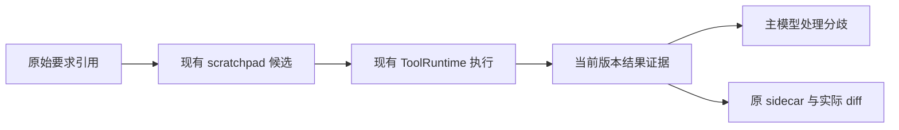

# 显式需求约束驱动的边界自测

_NZ-Coder · 2026-09-09 · 最小产品增强与离线验证；真实效果未测。_

---

## 📋 范围与状态

交付状态：`IMPLEMENTED_AND_OFFLINE_VERIFIED`，不是 `LIVE_COMPARISON_COMPLETED`。

本阶段从 `744fba060ed07abad5566a1e25aadbcebccfbcef` 的干净工作区建立
`codex/constraint-boundary-selftest`；原 `codex/linux-coding-baseline` 引用不移动。
本轮实现、测试和报告均在新开发分支。产品源码已变化，不能再称为 P2 的
Agent revision `7c308e3a75deae112e20c0de225113fda6ec9f9e`。
精确实现 SHA 与最终交付 SHA 随提交交付；旧 live freeze 的产品版本检查没有放松。

唯一行为变量是默认关闭的 `NZ_CONSTRAINT_BOUNDARY_SELFTEST_ENABLED`。
它进入配置 schema、默认值和不可变 `ConfigSnapshot` / `RunSettings`。
关闭时不增加消息、模型调用、自测阶段或工具；planning、reflection、sidecar
模式、费用结算及 AgentRunner 均未修改。受控 HTTP 响应只用于离线测试。

真实模型新增调用 **0**，真实 A/B 启动 **0**，本轮新增真实费用及未知预留 **0 CNY**。
没有创建真实授权、live 结果或新实验登记，没有重跑或覆盖 P0/P1/P2。
假设“约束对应的少量反例可减少共同漏检”尚未得到真实模型证据支持。

## 🔍 T07 证据与实际缺口

历史来源：[P2 报告](linux-coding-baseline-v1-p2.md)、
[封存结果](../../evaluation/linux_baseline/results/p2-live-20260909-062500/result.json)、
[原始补丁](../../evaluation/linux_baseline/results/p2-live-20260909-062500/T07.patch)。
只按需读取私有 T07 Session、runtime_state 和运行事件；下表不公开模型正文或宿主路径。

| 观察事实 | 对应位置 | 确认程度 | 本轮处理 |
| --- | --- | --- | --- |
| 用户要求删除标点、保留连字符等约束仍在 Session | T07 初始用户消息、request 描述符 | 原文已核对；最终 HTTP 消息未封存 | 保留原文引用，不虚构历史 wire |
| 没有 TaskContract、RequirementLedger 或 VerificationContract | T07 runtime_state，三者均为空；plan_generated=false | 运行状态已确认 | 无合同也可做原文候选引用 |
| planning 关闭不必然等于无合同 | `loop._maybe_generate_plan` 先尝试零调用引导；`derive_task_contract` 在没有明确验收命令时返回空 | 源码与本题状态相符 | 不打开 planning，不另造合同 |
| SEMANTIC_CONTRACT_CERTIFICATION 未生效 | 空 ledger；terminal 事件 semantic pending=false | 运行状态＋实际分支 | 不声称已有语义合同认证 |
| 确实做过开发测试，24 passed | 20 个新增参数化例子＋4 个原回归；verification_result 事件116；工具消息16 | 真实输出已确认 | 不是“缺少测试数量”问题 |
| sidecar 路径提供实际 diff，包括测试修改 | ChangeTracker → `_evidence` → 有界 diff | 路径确认；历史渲染正文未保存 | 继续使用实际 diff |
| 普通 transcript 渲染不含 role=tool 结果 | `_render_transcript`；无 exact contract 时无对应完整执行输出分支 | 源码缺口确认 | 增加有界、带来源的执行证据 |
| 测试结果可关联 generation3；不是整体语义证明 | 工具消息 `_nz_mutation_generation=3`；terminal generation3 | 已确认 | 复用 generation，不新增版本系统 |
| 正常 sidecar 调用接受，非缓存或降级 | gate事件192：multi-file；gateway194；sidecar196：accept/verifier_ok；terminal197：finalize/completed | 已确认 | 不改写历史 verdict |
| 正则字符集与要求不一致 | 原补丁 `[^\w\s-]+` 留下下划线；独立目标3/4、原回归4/4 | 补丁及验收确认 | 临时副本已知开发回归 |

P2 仍是启动7题、端到端成功5题、T07功能失败、T09发送前预算阻断、T10–T12未启动，
主成功率 **5/7**。T07 并非完全没有正常、Unicode、空白或标点测试；缺的是区分便利
正则实际字符集合与明确要求的反例。没有证据证明仅补充输出就一定会使真实 sidecar 改判。

T07 无 ledger 时完成条件允许走原完成路径，真实 sidecar 给出合法 accept，随后正常结束。
最终 runtime_state 中 verification_generation=-1，静态验证管理状态仍 verifying；
这不能推翻已执行回归，也不能证明全套语义验证。没有借本轮重写全局完成状态机。

## ⚙️ 一个有界增强及参数负责人

实现位于 [constraint_boundary.py](../../nz_coder/runtime/verification/constraint_boundary.py)。
接线仅涉及配置、现有主 prompt builder、tool result projector、RuntimeState 的少量
运行作用域字段、现有 sidecar hook；没有新工具、Agent、测试 DSL 或第二套需求账本。



主模型被要求选择最多4条高价值原文约束、6项有区分力的候选，不要求凑满。
每项通过现有 `update_scratchpad(category="plan")` 的最多500字符 JSON 记录：
`boundary_check` 内含 `quote / assumption / input / expected / basis / command`。
quote 必须是原始需求的非空精确子串；模型的 basis/expected 明确标为未验证解释，
不会写入 TaskContract 或 RequirementLedger，不从当前实现输出生成权威 expected。

有效 note 的 runtime 投影保存候选摘要 hash；相同 quote/input 的更新改变候选身份。
超出4/6的候选不进入本增强的证据集合。普通 Agent 自己可能继续提出测试；本增强不
扩大既有轮数/工具/时间预算，也不声称能保证模型严格遵循所有自然语言上限。

只有已成功执行的 scratchpad 更新可登记候选。后续 bash 的实际结果按精确 command
关联当时已有候选，不将事后拟定 expected 自动关联到早先的通过结果。
数据字段包含候选 hash、tool_call_id、实际 exit、generation、输出尾部最多1200字符及输出 hash。
修改实现或测试后 generation 改变，旧证据标 stale；Undo/Redo 沿用原有失效机制。
额外作用域字段只保留首次 activation 的既有 started_at 来源，避免新任务 generation
归零后误用历史结果；恢复时保留该来源，允许现有墙钟预算单独 rebase，不产生新的版本序号。

主请求与 sidecar 读取相同的 `BOUNDARY_EVIDENCE_JSON` 投影。主动态上下文仍受原 context
预算裁剪，sidecar 仍使用原有有界 diff；没有注入全部源码或历史。投影丢失或截断时不能
补造通过证据。重复构建只是替换同一动态上下文，不累计新用户要求或自动重跑工具。

| 层次 | 能证明的事实 | 不能证明的事实 |
| --- | --- | --- |
| 候选 note | 模型提出并保存过解释 | 要求解释一定正确、检查已执行 |
| ToolRuntime | 命令实际执行、退出状态、当前 generation | 模型预期正确、整个需求满足 |
| `passed` | 可识别验证命令，可靠 shell 链，真实 exit0，报告非零通过数 | 被测用例必然覆盖候选语义、任意输出可信 |
| `executed_unconfirmed` | 命令执行，但不足以证实测试通过 | 零收集、全跳过或无输出是成功验收 |
| sidecar verifier_ok | 得到了合法判定 | 判定必然正确 |

复用 `classify_verification_command` 和 `verification_success_is_reliable`：
`printf '1 passed'`、掩盖失败的 `||`/`;` 链不能变成 passed。测试内容和 stdout 仍可能不诚实，
所以不把报告通过升级为语义认证。工具输出与候选字符串作为 JSON 数据，不能改变权限。

存在当前作用域/版本的失败时，sidecar hook 先复用已有 reanimate 路径，一轮内最多补充
一次反馈：依据原要求决定修实现，或说明理由修正错误 expected。再次无进展时使用已有
`complete_unverified`，不付费请求泛化 accept 来擦掉失败。不执行/取消/全跳过的后续尝试
不会释放先前未解决失败；当前可靠通过或真实版本变化才影响适用性。
这不是认定模型测试必然正确，也没有增加全局终止状态机。没有失败证据、缺少无关测试
或未执行检查不会自动阻断正确实现。现有 sidecar 的模型、请求格式、降级策略均不变。

planning 关闭、无 TaskContract 时仍从当前初始需求引用工作；普通聊天和文档范围不加入
自测。提示明确遵守不改测试、不执行命令等要求；工具仍走已有权限检查，没有 subprocess
捷径。一次补充反馈计入原 stop-hook、主轮次、Token、时间和费用预算；取消继续抛出取消。

## ✅ 离线验证与反例

验证只证明机制与接线，不是模型任务成绩。

1. 已知开发回归：新临时副本重放原 T07.patch；原24项开发/回归仍通过，但依据明确标点要求
   检查 `slugify('A_B') == 'ab'` 时退出1且 AssertionError。原补丁 hash 不变。
   T07 已用于开发，不能进入独立泛化结论。
2. 三类人工语义对照：类别排除与明确例外（另含必须保留下划线的反向对照）、单次迭代且稳定
   去重、验证失败保留已有状态。每类有正确与仅违反该约束的实现，预期来自组织者对明示
   要求的解释，不宣称严格独立或真实模型发现。
3. 实际 CLI → Native → 正式 Gateway/Provider/SDK → 受控 HTTP，使用真实工具和 sidecar。
   修复脚本：失败检查 → 一次反馈 → edit_file → 当前版通过 → sidecar；关闭增强脚本沿旧路径。
   同时覆盖模型 usage 丢失立即停发，以及 plan 权限拒绝写测试/执行命令。

受控修复脚本的实际结构化事实：主请求 enabled/high/8000，辅助 disabled/无effort/1024，
保留强制 `emit_sidecar_verdict`；两者共用原 BudgetTransport/Ledger。修复脚本8次主请求、
1次辅助请求；关闭脚本5次主请求、1次辅助请求。这里的差异由脚本演示机制产生，不是
真实 A/B 的效果或开销估计。测试用量为虚假固定 usage，不计入任何历史费用。

首次有效 red 命令：

```bash
PYTEST_DISABLE_PLUGIN_AUTOLOAD=1 .nz-coder-runs/p1-env/bin/python -m pytest -q \
  tests/runtime/test_constraint_boundary_selftest.py --tb=short
```

在新测试已加入、产品尚未修改时：1 failed、1 passed；失败是工具结果没有候选关联字段。
之后主请求/sidecar/一次反馈用例：3 failed、3 passed，分别缺少实际输出投影、主上下文和
反馈；均非导入错误。独立复核新增8项反例曾失败，修复后通过：不确定重试掩盖失败、
伪通过输出、跨任务同 generation 误复用。早期测试 fixture 参数错误不计作有效 red。

最终命令（退出0；415 passed、1 skipped，136.59秒）：

```bash
PYTEST_DISABLE_PLUGIN_AUTOLOAD=1 .nz-coder-runs/p1-env/bin/python -m pytest -q \
  tests/runtime/test_constraint_boundary_selftest.py \
  tests/runtime/test_constraint_boundary_native.py \
  tests/runtime/test_constraint_boundary_semantics.py \
  tests/runtime/test_task_contract.py tests/runtime/test_verification_contract.py \
  tests/runtime/test_completion_gate.py tests/runtime/test_prompt_builder_runtime.py \
  tests/runtime/test_native_runner.py \
  tests/runtime/tool_runtime/test_focused_projection.py \
  tests/runtime/tool_runtime/test_boundary_contracts.py \
  tests/test_runtime_state.py tests/test_requirement_analyzer.py \
  tests/test_sidecar_verifier.py tests/test_llm_judge.py \
  tests/test_cancellation_safety.py tests/test_tool_cancellation_context.py \
  tests/security/test_run_settings.py tests/security/test_nested_run_snapshot.py \
  tests/security/test_user_runtime_state.py tests/test_headless_cli.py \
  tests/evaluation/test_p1_sidecar.py tests/evaluation/test_p1_billing.py --tb=short -rs
```

唯一 skip 是既有 `tests/security/test_user_runtime_state.py:40` 的 Windows junction semantics，
本次 Linux 不适用。新增37项测试均执行，没有新增 skip 或删除旧断言。
独立只读复核提出的三项重要问题已修复，复核者重新运行自测单元28项全部通过。

以下静态核验均退出0，Ruff 无问题，类型检查0 errors/0 warnings，且两个故意不兼容的
工具类型反例被拒绝。无评测驱动变更，未重跑 P0 或全平台测试。

```bash
ruff check nz_coder/runtime/verification/constraint_boundary.py \
  nz_coder/foundation/config.py nz_coder/foundation/workspace_trust.py \
  nz_coder/runtime/conversation/prompt_builder.py nz_coder/runtime/core/run_settings.py \
  nz_coder/runtime/execution/runtime_state.py nz_coder/runtime/tool_runtime/result_projection.py \
  nz_coder/runtime/verification/sidecar_verifier.py \
  tests/runtime/test_constraint_boundary_selftest.py tests/runtime/test_constraint_boundary_native.py \
  tests/runtime/constraint_boundary_controlled.py tests/runtime/test_constraint_boundary_semantics.py
.nz-coder-runs/p1-env/bin/python -m py_compile \
  nz_coder/runtime/verification/constraint_boundary.py \
  nz_coder/foundation/config.py nz_coder/foundation/workspace_trust.py \
  nz_coder/runtime/conversation/prompt_builder.py nz_coder/runtime/core/run_settings.py \
  nz_coder/runtime/execution/runtime_state.py nz_coder/runtime/tool_runtime/result_projection.py \
  nz_coder/runtime/verification/sidecar_verifier.py \
  tests/runtime/test_constraint_boundary_selftest.py tests/runtime/test_constraint_boundary_native.py \
  tests/runtime/constraint_boundary_controlled.py tests/runtime/test_constraint_boundary_semantics.py
.nz-coder-runs/p1-env/bin/python tests/typecheck/check_tool_contracts.py
git diff --check
```

## 🧪 有限 A/B 计划：尚未执行

最多4任务 × 两臂 × 每臂首次一次，固定串行交错顺序：
`D-A → D-B → X1-B → X1-A → X2-A → X2-B → X3-B → X3-A`。
D 可使用 T07 已知诊断题，单独报告；X1–X3 为不同语义约束的小型迁移任务，至少一个
从正确实现出发用于测量过度修订。确切迁移输入树、需求及盲评验收应在实现 SHA 冻结后
一次性确定，再固定总预算与授权；不得读 A 的结果后调整 B，也不扩大到出现正效果为止。

优先由未参与实现的评测者准备 X1–X3；若只能由本组织者完成，标为“自建迁移测试”，
而非严格未见集。本次人工语义对照不直接包装成这三个真实迁移任务。
未访问 T09–T12 的隐藏验收来指导增强；P2 未完成题保持封存状态。

A/B 使用同一个新产品与同一个新驱动，A关闭/B开启此唯一开关。
A 的关闭契约和现有回归须通过，不能直接将跨日期 P2 作为 A。
相同主/辅助模式、模型、初始树、工具、每臂5 CNY上限、累计2,000,000 Token、30轮、600秒；
整批预算须另行明确授权并冻结，不能将8×5自动视为已授权40 CNY。
新版本薄适配尚未建立真实授权入口；不得删掉旧 live 的 Agent 版本校验来启动。

各臂独立 Session/用户状态/任务副本，不继承开发记忆、报告、原 T07 反例、参考补丁或其他臂。
独立验收放在 Agent 不可读位置，运行停止先导出补丁再重放验收；不得反馈隐藏结果重试。
费用未知、预算/时间或基础设施阻断即保留现场停止，不发补覆盖 sidecar 的请求。

预先记录：独立功能验收、约束漏检、正确实现无谓修改、自测提议/写入/执行/通过、sidecar
verdict 与 trace、工具数、额外修复轮次、Token、耗时、已知费用和未知预留、预算停止。
失败任务包含在已启动分母；未运行单列，0启动成功率为null。T07诊断与X1–X3迁移分开。
一次小样本只作描述性分析，不宣称显著或稳定提升；负结果、仅T07有效、增加成本或退化均保留。

## ⚠️ 预算、污染边界与限制

封存 P2 result.accounting 核对为：累计已知折算费用 **3.636158 CNY**，
旧未知预留 **3.154944 CNY**，余额 **3.208898 CNY**；仍不是账户余额或完整账单。
按旧主请求预留 **3.217728 CNY**，该余额不足首请求准入，也不构成本轮授权。
没有降低预留、释放请求14、更新费用系统或新增付费探针。

本增强依赖模型愿意提出并正确解释候选；精确原文匹配和500字符工作笔记格式可能漏掉
复杂/多语言表达。任务分类也可能漏判。不能保证反例有区分力，不能证明真实模型会想到它。
输出裁剪、历史压缩或未使用约定 note 会使证据不完整；没有完整文件级语义映射。
当前 generation 是既有运行时修改观察，不是外部进程未被察觉改写文件的完整证明。
这些限制不能用更多离线 Fake 用例换成“质量提升”结论。

新增代价主要是有界上下文和可能的一次补充反馈，以及模型选择进行的真实测试。
没有额外独立模型调用，但同一主循环可能因此更长；真实额外 Token/费用只有新授权 A/B 才能测。
测试仅限 Linux headless Native、本地人工任务，不代表 SWE-bench、Windows HTTP、TUI 或完整多Agent验证。

历史公开结果、私有账本、授权、补丁和原登记不改写。原始离线请求正文只留临时测试现场；
本报告是人工审阅的最小公开投影，不提交完整模型正文、key、完整环境或宿主私有路径。
交付前对三个历史实验48个关键私有文件（账本、冻结/授权、请求、补丁、结果/摘要）的
两次只读 SHA-256 清单比较一致；不是宣称重新审计全部历史数据。
`git diff` 确认原 evaluation 目录及两个历史报告没有改动；原评测分支仍指向 `744fba060...`。

关键公开 SHA-256（原文件不改写）：

| 文件 | SHA-256 |
| --- | --- |
| 原 T01 实验 result.json | `04cca793c45f5e766477074e3a79b96e24bc6a251802e5a3b1a73e1cbcd1b6b1` |
| 原 T04 实验 result.json | `b93eacfe22eadef7dffdb55d83c58d3cd3a064cb4455fe6f0702269d004de805` |
| P2 result.json | `d8ccc8e3d9a9c275b7e94a2665e2de529a026d5fc23c5796e6a8f7eb40cf027b` |
| T07.patch | `f0f149256f880216911f37c9a80123670c8eb7b3bd231c76a9815d6173e7714b` |
