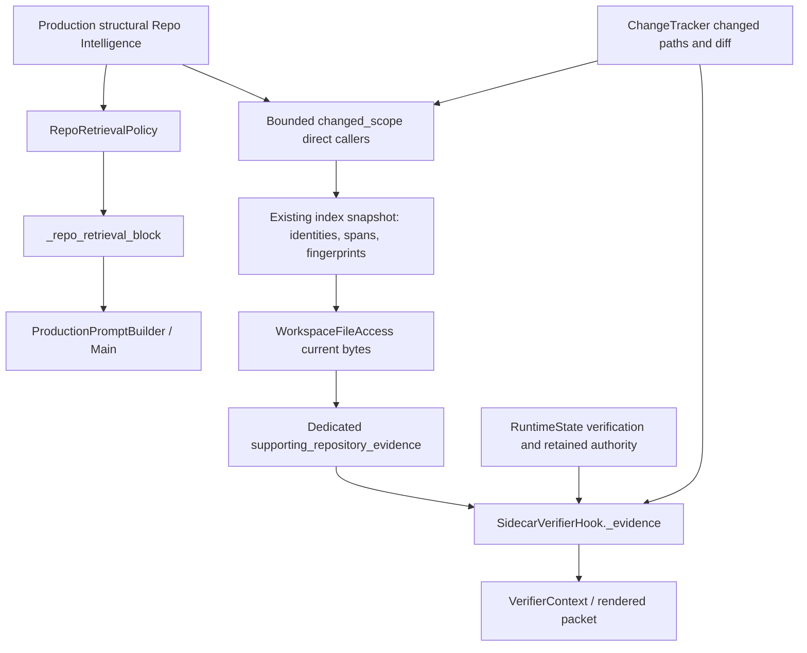

# Evidence ownership

Main's production policy already renders direct/impacted callers. Sidecar's
nearby-source reader was limited to blocked-environment review, so normal review
could not receive unchanged caller bodies. The new helper does not reuse the Main
exploration policy or introduce another index/parser. It uses changed_scope then
PersistentCodeIndex.snapshot for definitions/spans/fingerprints. It does not call
symbol_context with unsupported path:symbol syntax.

Only sorted direct callers are considered. Impacted/transitive callers are not
added: the existing graph's impacted_callers currently duplicates direct_callers.
The independent section explicitly denies task, instruction, edit and permission
authority. Existing verifier system/decision prompts, retained reference rendering,
TaskContract, Ledger and completion policy remain unchanged.

The full current hook is replayed, including current compatibility-delta criteria.
Historical-frozen-packet.json preserves the previous CF controlled packet; RED and
GREEN current-hook packets differ only in the new supporting context fields and
rendered section. These offline packets are never sent.
