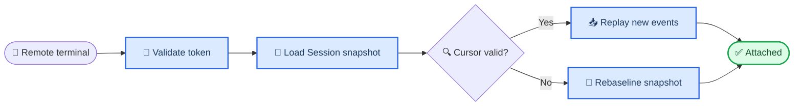

# NZ-Coder remote and daemon guide

_Operate resumable Sessions through the authenticated loopback service._

---

## 📋 Support boundary

The current daemon is a **same-machine loopback service**. It supports local
terminal attach, reconnect, authenticated HTTP, Session recovery, interactions,
attachments, child status, and persistent process control. It is not presented
as an internet-facing multi-tenant server.

Attachment paths are interpreted and revalidated inside the daemon's registered
workspace. Arbitrary client-machine uploads to a daemon on another machine are
not implemented.

The terminal labels a same-machine endpoint as `LOCAL DAEMON`. An explicit
cross-host URL is labelled `REMOTE · <endpoint>` in the composer. For a true
remote URL, `@file`, dropped files, `/attach`-style client paths, and clipboard
images are disabled with an actionable error; NZ-Coder never sends a local path
and pretends that it exists on the server.

## 🚀 Start and attach

```bash
nz-coder daemon start --workspace /path/to/repository
nz-coder daemon status
nz-coder attach SESSION_ID
nz-coder daemon stop
```

The daemon owns a private token file and rejects missing, short, wrong, or
browser-origin credentials. It persists Session events and uses replay cursors;
expired cursors trigger a snapshot rebaseline instead of silently dropping
events.

## 🔄 Recovery behavior



After daemon restart, an accepted but unsettled run becomes
`interrupted/recoverable`; it is never left as `RUNNING` and never reported as
completed. Permission and question replies are identity-bound, single-use, and
rejected when late or sent from the wrong Session.

## 🔧 Remote controls

Remote TUI supports Session inspect/resume/rename/delete/fork/abort, timeline,
message inspection, diff, undo/redo, parent/children/subagents, export,
persistent process controls, extension/skill/MCP inspection, and daemon-resolved
custom commands. `/agents` projects the primary and supported child definitions.
`/workflow` can prepare an exact daemon-side plan, display its risk and bounded
limits for approval, then run/list/show/pause/resume/stop it through the
Session-owned Workflow manager. An approval digest cannot authorize a modified
plan.

`/memory` exposes pending/inspect/approve/reject/ledger against the daemon
Session's `MemoryControlPlane`. It preserves fingerprint compare-and-apply and
does not introduce a Remote memory store.

The `!command` shorthand is intentionally unavailable while attached. Use an
Agent request to invoke the daemon Bash tool or `/processes` to inspect daemon
processes; the attach client never executes an ambiguous local shell command.

Model and permission selection remain per-run/Session concerns. Remote attach
does not mutate daemon-global model state. Cross-host upload, TLS termination,
accounts, and organization sharing are outside the current product boundary.
