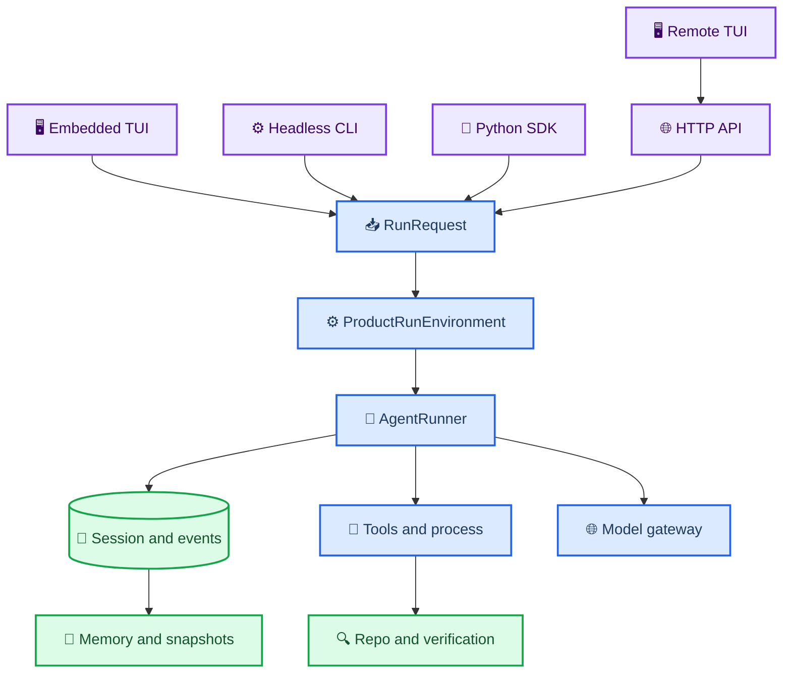

# NZ-Coder terminal product parity final report

_Fresh source audit and executable product evidence against InfCodeX and infcode-dev/OpenCode, 2026-08-13._

---

## 📋 Scope and evidence

This report audits the current source trees, not earlier parity percentages:

- NZ-Coder product surfaces under `nz_coder/interface`, `nz_coder/http_service`,
  `nz_coder/extensions`, and `nz_coder/evaluation`
- InfCodeX product code under `references/InfCodeX/src`,
  `references/InfCodeX/packages/repl`, and `references/InfCodeX/packages/agent`
  at nested repository commit `d3a812379b589597347f5be12d5b68477e577f02`
- OpenCode/infcode-dev product code under
  `infcode-dev/infcode-dev/packages/opencode/src`; this imported snapshot has no
  independent Git metadata, so the path and audit date are its revision identity

The final `ProductScenarioSuite` passed **20/20**. T1, T2, T3, and T9 are
real-product scenarios: T1 built and installed the package and exercised a real
PTY; T2 drove `/connect`, masked credential input, loopback model discovery,
private `.env` persistence, and model activation; T3 drove the actual PTY through
an OpenAI-compatible SSE model→`write_file`→model coding turn; T9 started a real
authenticated daemon and executed attach/reconnect. The other 16 entries are
focused component contracts, not claims of 16 additional end-to-end user
journeys. The final full local regression passed 1986 tests
with seven Python 3.13 `fork()` deprecation warnings and no failures.
The durable machine report is
[`evidence/terminal-product-final-2026-08-13.json`](evidence/terminal-product-final-2026-08-13.json).

## 🔗 Product runtime flow

## 📊 Surface capability matrix

| Capability | Embedded | Headless | SDK | HTTP | Remote |
| --- | --- | --- | --- | --- | --- |
| Canonical native run | Aligned | Aligned | Aligned | Aligned | Aligned through HTTP |
| Session persistence | Aligned | Configurable | Configurable | Aligned | Aligned |
| Attachments/FileParts | Aligned | Aligned | Aligned | Daemon-validated | Local-daemon semantics |
| Model selection | Interactive | Flags | Request field | Per request | View/run-bound; no daemon-global mutation |
| Permission interaction | Interactive | Fail-closed/noninteractive | Callback | Broker | Interactive broker |
| Questions | Interactive | Different by design | Callback | Broker | Interactive broker |
| Skills and MCP execution | Aligned | Aligned | Aligned | Aligned | Executes server-side; read-only status UX |
| Memory review | Aligned | CLI control | API owner | Runtime owner | Pending/inspect/approve/reject/ledger |
| Persistent processes | Aligned | Tool/API | SDK/runtime | CRUD and logs | List/inspect/log/follow/kill |
| Custom commands | Workspace/user/bundled | Aligned | Different by design | Daemon expansion | Daemon expansion |
| Tool rendering | Shared renderer | Machine output | Events | Events | Shared renderer |
| Direct shell | Permissioned local workspace | Different by design | Tool call | Daemon tool | Daemon-side only |

There is no silent second runtime in this matrix. `Different by design` means a
machine surface intentionally exposes structured input/output rather than local
terminal affordances.

### Input ownership classification

| Input capability | Classification | Embedded | Remote behavior |
| --- | --- | --- | --- |
| Theme, mouse, local editor process | `LOCAL_UI_ONLY` | Local terminal preference | Intentionally client-local or unavailable |
| Direct `!command` | `LOCAL_UI_ONLY` | Permissioned embedded Bash path | Rejected; it never runs silently on the client |
| Session, permission, question, process | `REMOTE_RUNTIME` | Local Runtime owner | Daemon owner through authenticated HTTP |
| Project custom-command files | `REMOTE_RUNTIME` | Workspace resolver | Resolved inside the daemon workspace |
| Prompt text, multiline, history, slash completion | `SHARED` | Terminal adapter | Remote terminal adapter |
| File/image/document attachment parts | `SHARED` | Canonical `UserSubmission` | Same message parts; daemon revalidates paths |
| Model/mode display | `SHARED` | Current Session/run | Read-only current Session/run projection; no global daemon mutation |

Remote attach deliberately does not interpret `!command` as a local client
shell. A remote shell action must be requested through the daemon-owned Agent
tool or ProcessService, so its workspace and permission boundary are explicit.

### Platform capability matrix

| Capability | Linux | macOS | Windows | WSL |
| --- | --- | --- | --- | --- |
| TUI and text input | Verified | Designed, unverified host | Designed, unverified host | Linux TUI contract |
| Clipboard text/image | X11/Wayland helpers + OSC 52 | `pbcopy`/`pngpaste` probe | `clip`/PowerShell probe | PowerShell interop probe |
| File paths/editor | POSIX, verified | POSIX probe | Native paths, host-owned editor | Linux paths; explicit host interop |
| Shell/ProcessService | POSIX shell + PTY | POSIX shell + PTY design | PowerShell/cmd + conditional ConPTY + pipe fallback | Linux shell + PTY |
| PTY resize/signals/Ctrl+C | Verified | POSIX design | Conditional pywinpty ConPTY; pipe fallback | Linux semantics |
| Daemon/token/HTTP attach | Verified loopback | Designed loopback | Designed loopback | Designed loopback |
| Tree-sitter/LSP | Installed adapters reported | Installed adapters reported | Installed adapters reported | Installed adapters reported |

`nz-coder platform --json` is the executable host-specific truth. This table
does not turn an untested host into a release claim.

## 📚 Three-way capability matrix

`Verdict` evaluates NZ-Coder at the terminal/developer-product layer. It does
not infer equality from matching file names.

| ID | Capability | nzcoder | InfCodeX | OpenCode | Verdict | Priority |
| --- | --- | --- | --- | --- | --- | --- |
| C001 | No-argument terminal start | Native prompt_toolkit product | Constructed REPL/TUI | OpenTUI product | Aligned | P0 |
| C002 | Version command | `--version` | CLI version | CLI version | Aligned | P0 |
| C003 | First-run initializer | Safe `.env` initializer | Config/bootstrap flows | Auth/config onboarding | Mostly aligned | P0 |
| C004 | Credential-free diagnostics | Classified doctor | `kodax_doctor` | CLI diagnostics/config | Aligned | P0 |
| C005 | Startup error boundary | Typed product errors; regression tested | TUI error boundaries | CLI/TUI error handling | Mostly aligned | P0 |
| C006 | Multiline composer | Alt+Enter and persistent editor | Rich REPL composer | OpenTUI composer | Aligned | P0 |
| C007 | Persistent history | Workspace history | REPL history | TUI history | Aligned | P0 |
| C008 | History search | prompt_toolkit search | TUI search | TUI search | Aligned | P0 |
| C009 | Slash completion | Categorized dynamic registry | Constructed commands | Command palette | Aligned | P0 |
| C010 | File completion | Bounded `@` workspace completion | Media/file input | File completion | Mostly aligned | P0 |
| C011 | Path paste/drop | Workspace path detection | Media pipeline | Input expansion | Aligned | P0 |
| C012 | File attachment | Canonical FilePart | SDK media | Session input parts | Aligned | P0 |
| C013 | Clipboard text | Native plus OSC 52 | TUI clipboard | TUI clipboard | Mostly aligned | P0 |
| C014 | Clipboard image | Linux/macOS/Windows/WSL helpers | SDK media | TUI paste support | Mostly aligned | P0 |
| C015 | External editor | Configurable editor handoff | TUI/editor integration | Editor integration | Mostly aligned | P0 |
| C016 | Provider abstraction | Native adapters plus OpenAI-compatible | Broad provider package | Broad AI SDK provider registry | Partial | P0 |
| C017 | Model picker | Recent/favorite/discovery | CLI/provider selection | Rich model dialog | Mostly aligned | P0 |
| C018 | Reasoning effort | Model variant control | Capability-aware reasoning | Provider/model variants | Aligned | P0 |
| C019 | Capability snapshot | Immutable per run | Provider capability profiles | Model metadata transforms | Aligned | P0 |
| C020 | Hot model switch | Rebuilds Session environment | CLI/runtime option | TUI selection | Mostly aligned | P0 |
| C021 | New Session | Durable Session identity | SDK Session | Server Session | Aligned | P0 |
| C022 | List/inspect Session | Terminal and HTTP | SDK/CLI | CLI/server/TUI | Aligned | P0 |
| C023 | Resume/continue | Durable restart path | SDK Session resume | Session routes | Aligned | P0 |
| C024 | Rename Session | Embedded and Remote | Session metadata | Session update | Aligned | P0 |
| C025 | Delete Session | Confirmed cleanup | Session cleanup | Session delete | Aligned | P0 |
| C026 | Fork Session | Rekeyed graph and child clones | Agent/session primitives | Session fork | Aligned | P0 |
| C027 | Timeline/message inspect | Stable turn view | Runtime events | TUI/session messages | Aligned | P0 |
| C028 | Export transcript | Embedded and Remote | SDK data access | Export command | Mostly aligned | P0 |
| C029 | Undo/revert | Transactional turn/file undo | Runtime safeguards | Snapshot revert | Mostly aligned | P0 |
| C030 | Redo/unrevert | Guarded redo stack | Different workflow | Session unrevert | Different by design | P0 |
| C031 | Parent/children lineage | Durable lineage | Runtime agent binding | Session relations | Aligned | P0 |
| C032 | Interrupted recovery | Explicit recoverable terminal state | Daemon journal/recovery | Run-state recovery | Aligned | P0 |
| C033 | Unified RunRequest | Five surfaces share request contract | SDK runtime request | Server/session prompt contract | Aligned | P0 |
| C034 | Single Session truth | SessionRuntime owner | SDK Session owner | Server Session owner | Aligned | P0 |
| C035 | Single tool truth | ToolRuntime registry | Agent capability runtime | Tool registry | Aligned | P0 |
| C036 | Context compaction | Model-aware budget and durable summary | Mature compaction/evals | Context budget/compaction | Mostly aligned | P0 |
| C037 | Tool-result budget | Aggregate policy plus durable artifact | Bounded evidence strategies | Part compaction | Aligned | P0 |
| C038 | Runtime middleware | Typed ordered pipeline | Agent middleware patterns | Plugin/hooks processors | Mostly aligned | P0 |
| C039 | Transaction rollback | File transaction and change tracker | Runtime mutation controls | Snapshot/revert | Aligned | P0 |
| C040 | Authenticated HTTP | Loopback token service | Runtime daemon/AAMP/ACP | Full server routes | Mostly aligned | P0 |
| C041 | Daemon lifecycle fence | PID identity and owner token | Daemon manager/journal | Server lifecycle | Aligned | P0 |
| C042 | Remote attach | Terminal attach | Shared daemon clients | Remote TUI | Aligned | P0 |
| C043 | Event replay cursor | Durable cursor and gap repair | Runtime event protocol | SSE/event bus | Aligned | P0 |
| C044 | Snapshot rebaseline | Explicit expired-cursor recovery | Daemon state restore | Session sync | Aligned | P0 |
| C045 | Reconnect loop | Bounded resilient client | Runtime daemon client | Remote TUI reconnect | Aligned | P0 |
| C046 | Remote permission | Single-use identity broker | AAMP permissions | Permission routes | Aligned | P0 |
| C047 | Remote question | Validated interaction broker | Protocol interaction | Question routes | Aligned | P0 |
| C048 | Two-client arbitration | First valid reply wins | Protocol owners | Server permission state | Aligned | P0 |
| C049 | Remote file semantics | Same-host daemon paths | SDK/daemon media | Server file APIs | Partial | P1 |
| C050 | Cross-host upload | Designed, not implemented | Protocol-dependent | Server upload APIs | Missing | P2 |
| C051 | Persistent process owner | Workspace ProcessService | Runtime/CLI processes | PTY service | Aligned | P1 |
| C052 | Interactive PTY | POSIX PTY | TUI/daemon process support | node-pty/Bun PTY | Mostly aligned | P1 |
| C053 | Cursor log reads | Bounded cursor and gap | Runtime event/process logs | PTY stream | Aligned | P1 |
| C054 | Resize | POSIX resize | Host-aware TUI | PTY resize | Mostly aligned | P1 |
| C055 | Descendant cleanup | Process-group sweep | Process-tree handling | PTY disposal | Aligned | P1 |
| C056 | Windows ConPTY | Conditional pywinpty backend with read/write/resize/kill and pipe fallback | Explicit ConPTY host handling | node-pty support | Source-aligned; native evidence pending | P0 |
| C057 | Permission modes | default/acceptEdits/plan/auto | AAMP policy | Rule evaluation | Aligned | P0 |
| C058 | Scoped always rule | Operation/command scoped | AAMP permissions | Pattern rules | Aligned | P0 |
| C059 | Dynamic tool effects | Runtime enforcement | Capability policy | Permission arity/effects | Aligned | P0 |
| C060 | Permission reconnect | Durable broker identity | Daemon controls | Permission routes | Aligned | P0 |
| C061 | Direct-shell permission | Normal Bash pipeline | CLI/runtime policy | Bash tool policy | Aligned | P0 |
| C062 | Foreground child Agent | Shared AgentRunner | Agent primitives | Task tool/agent | Aligned | P0 |
| C063 | Background Agent | Parallel manager with conflict gates | AAMP/team runtime | Agent manager | Aligned | P0 |
| C064 | Child continuation | Owned child Session resume | Runtime binding | Child Session continuation | Aligned | P0 |
| C065 | User `/agents` inspector | Shared read-only Agent catalog in Embedded and Remote | Runtime agent stores | Agent dialog/config | Mostly aligned | P2 |
| C066 | Workflow terminal controls | Embedded run lifecycle plus Remote prepare/approve/list/show/pause/resume/stop | Team/workflow CLI | Commands/workflows | Mostly aligned | P2 |
| C067 | Shared presentation adapter | Embedded/Remote renderer | TUI renderer runtime | Tool-part components | Aligned | P1 |
| C068 | Read card | Path and bounded lines | TUI cards | Read tool part | Aligned | P1 |
| C069 | Search card | Query/match summary | TUI output | Grep/search part | Aligned | P1 |
| C070 | Edit/diff card | File and change counts | Terminal output | Patch/diff views | Aligned | P1 |
| C071 | Bash card | Command/status/duration/tail | Terminal output | Bash part | Aligned | P1 |
| C072 | Process card | Identity/state/log hint | Process output | PTY component | Aligned | P1 |
| C073 | Child/verification/MCP cards | Domain-specific labels | Agent/TUI events | Task/plugin parts | Mostly aligned | P1 |
| C074 | Replay idempotence | Event-ID deduplication | Runtime event identities | Part/event identities | Aligned | P1 |
| C075 | Working scratchpad | Session-scoped | Agent memory/scratch | Todo/context state | Aligned | P1 |
| C076 | Governed proposal inbox | Risk/confidence/provenance | Mature governed memory | Different memory model | Aligned | P1 |
| C077 | Stale approval protection | Fingerprint compare-and-apply | Revision-aware memory | Different by design | Aligned | P1 |
| C078 | Review ledger | Append-only audit | Memory store/audit | Different by design | Aligned | P1 |
| C079 | Accepted memory edit/delete UX | CLI and Embedded curation through Session-owned MemoryManager | Curate tooling | Rules/memory editing | Mostly aligned | P2 |
| C080 | Skill discovery | Project/user/bundled precedence | Skill registry | Skill discovery | Aligned | P1 |
| C081 | Skill resources | Base URI and bounded samples | Resource-aware skills | Skill files | Aligned | P1 |
| C082 | Skill tool policy | Runtime narrowing | Skill capability policy | Tool policy | Aligned | P1 |
| C083 | Skill enable/disable | Owner-persisted | Skill CLI/install | Config skills | Mostly aligned | P1 |
| C084 | MCP transports | stdio/HTTP/SSE | Mature MCP runtime | Mature MCP runtime | Aligned | P1 |
| C085 | MCP OAuth | PKCE/refresh/single-flight | OAuth connect | OAuth provider/callback | Aligned | P1 |
| C086 | MCP prompt/resource discovery | Bounded catalog tool | Catalog/provider | MCP runtime | Aligned | P1 |
| C087 | Extension identity projection | Skill/hook/toolpack/MCP | Multiple capability owners | Plugin system | Different by design | P1 |
| C088 | Extension owner reload | Delegated with restart truth | Hot reload paths | Plugin/config reload | Mostly aligned | P1 |
| C089 | Universal marketplace | Intentionally absent | Skill install tooling | Plugin install ecosystem | Out of scope | P2 |
| C090 | Custom Markdown commands | Project/user/bundled and Remote | Skill/command UX | Config Markdown commands | Aligned | P1 |
| C091 | Effective config | Secret-free values | Doctor/config runtime | Config command | Aligned | P1 |
| C092 | Config provenance | `--sources` | Config resolution | Layered config | Mostly aligned | P1 |
| C093 | Classified doctor | Required/optional/experimental | KodaX doctor | Diagnostics | Aligned | P1 |
| C094 | Doctor fix hints | Actionable per check | Doctor guidance | CLI errors/help | Aligned | P1 |
| C095 | Shell completion | Bash/Zsh/Fish | CLI completion | CLI completion | Aligned | P1 |
| C096 | Wheel packaging | PEP 517 wheel and sdist built in release smoke | npm/binary releases | npm/binary installers | Different by design | P1 |
| C097 | Isolated install smoke | Real wheel/venv/PTTY | Release scripts | Install/release scripts | Aligned | P1 |
| C098 | Optional semantic dependency | Separate extra | Optional model/index paths | Indexing service | Aligned | P1 |
| C099 | Upgrade UX | pipx/uv/pip instructions | Self/update scripts | Upgrade command | Different by design | P1 |
| C100 | Uninstall data safety | Package removal preserves state | Config/data persistence | Data persistence | Aligned | P1 |
| C101 | Linux capability | Real PTY/release evidence | Supported | Supported | Aligned | P1 |
| C102 | macOS capability | Design probe, no host evidence | Supported | Supported | Partial | P2 |
| C103 | Windows capability | Explicit PowerShell/cmd, ConPTY backend, process-tree cleanup, windows-latest RC gate | ConPTY-aware | node-pty | RC implementation; native evidence pending | P0 |
| C104 | WSL capability | Explicit Linux-process/Windows-clipboard probe | Host-aware | Supported paths | Mostly aligned | P1 |
| C105 | Session stats and trace | Summary plus bounded trace | Tracing processors | Trace/session telemetry | Mostly aligned | P1 |

## 🧪 Product stress and metrics evidence

The bounded stress manifest maps every requested boundary to an executable
contract: widths and resize, CJK/emoji/ANSI/binary-looking output, 100 KB and
1 MB logs, large transcripts, 1,000 Sessions, 10,000-file completion, multiline
and bracketed paste, Ctrl+C/Ctrl+D, queued prompts, history/editor failure,
multiple Agents/processes, reconnect loops, delayed/event-gap streams,
permission/question/process/child reconnect, two clients, and daemon restart.
The manifest is owned by `nz_coder.evaluation.product_stress` and the actual
tests run in T7, T8, T10, T11, T12, and T18.

Product evidence records measured `attach_latency_ms` and
`reconnect_latency_ms` distributions from a real loopback daemon/terminal path,
plus `orphan_process_count` from the ProcessService cleanup benchmark. It also
records startup, Session resume, interaction recovery, render errors, event
duplication, command discovery, memory correctness, extension reload, doctor,
and isolated install outcomes. These are local product metrics, not WAN or
live-model quality measurements.

| Local metric | Final evidence |
| --- | --- |
| Installed CLI cold startup | 393.707 ms (`nz-coder --version`) |
| First Provider setup / interactive coding | Passed / passed (real PTY journeys) |
| Daemon attach latency | 403.629 ms median |
| Reconnect latency | 387.687 ms median |
| Command discovery | 12.179 ms for 200 project commands |
| Session resume / interaction recovery | Passed / passed |
| Render errors / event duplication | 0 / 0 |
| Orphan processes after cleanup | 0 |
| Memory review / extension reload / doctor / install | Passed / passed / passed / passed |

## 📏 Evidence-backed product assessment

| Dimension | Assessment | Basis |
| --- | --- | --- |
| Terminal Capability Coverage | High on Linux/POSIX | 105-item matrix and shared surface audit |
| Product Implementation Depth | Mature primary loop; ecosystem gaps remain | Real wheel/PTTY/daemon plus owner-backed controls |
| Product Reliability Evidence | Strong local evidence | T1–T20, stress contracts, full regression, release smoke |
| Platform Breadth | Partial | Linux verified; macOS/Windows/WSL not release-matrix verified |
| Extension Ecosystem | Functional but narrower | MCP/Skill/Hook/ToolPack/Command composition; no marketplace |

No fake-precision aggregate percentage is assigned.
## 🔍 Remaining gaps and comparative verdict

### vs InfCodeX

Aligned areas include the unified coding runtime surface, durable Sessions,
permission/question recovery, daemon attach/reconnect, MCP, governed memory,
skills, background Agents, persistent POSIX processes, and bounded tool output.
NZ-Coder is deeper in transactional local file rollback, explicit stale-memory
approval rejection, and source-external Python wheel/PTTY release smoke.

The material gaps are InfCodeX's more mature cross-platform terminal engine,
explicit Windows/remote-ConPTY handling, broader provider integrations, and a
richer visual agent/team selector. NZ-Coder now exposes the Runtime-owned Agent
catalog and Remote Workflow lifecycle, but its presentation is intentionally
smaller than InfCodeX's team-oriented UI.

### vs OpenCode

NZ-Coder now aligns on the behaviors most visible to an individual terminal
user: custom commands, Session fork/revert semantics, server events, remote
interactions, MCP/OAuth, skills, model/mode controls, tool cards, config, and
diagnostics. Its extension composition is intentionally split across MCP,
skills, hooks, tool packs, and commands rather than copied into a universal
plugin class.

OpenCode remains broader in plugin installation/ecosystem, provider breadth,
cross-platform PTY integration, remote/server file upload, IDE/GUI/client SDK
ecosystem, and cloud/product-specific collaboration. Cloud accounts, billing,
hosted marketplace, analytics, and organization sharing remain out of scope.

## ✅ Product verdict

### 内部/个人日常使用

**Mature on the verified Linux/POSIX path.** The install, terminal, native run,
Session, permission, daemon, process, memory, extension, and automation loops
have executable evidence. Provider quality and availability still depend on the
selected external service.

### 公开 GitHub Release Candidate

**Release Candidate with explicit platform labels.** Linux packaging and PTY are
release-proven. macOS, Windows, WSL, Python 3.9–3.11, public provider calls, and
third-party MCP interoperability require host/credential matrices before a
general-availability claim.

### 与成熟产品并列时的 Demo 感

**The core terminal path no longer has obvious Demo behavior on Linux.** The
remaining visible gap is breadth rather than a half-built loop: Windows now has
a conditional ConPTY implementation but still lacks native hosted evidence,
true cross-host upload is absent, Agent/Workflow UX is table/command oriented
rather than a rich graphical picker, and there is no OpenCode-scale plugin/IDE/
cloud ecosystem.

## ⚠️ Honest next gates

1. Run the release matrix on macOS, native Windows, WSL, and Python 3.9–3.11
2. Require the new Windows Product RC workflow to pass before promoting Windows
3. Add a real upload API only when a cross-host daemon becomes a supported mode
4. Upgrade the current `/agents` and Remote Workflow command views to richer
   pickers only if real user feedback justifies the additional UI
5. Run credential-authorized provider and third-party MCP interoperability smoke

The retained compatibility seams and their live consumers are enumerated in
[`legacy-product-code-audit-2026-08-13.md`](legacy-product-code-audit-2026-08-13.md).
Two unconsumed seams were removed; symbols containing “legacy” were retained
when they still adapt a live owner into the canonical native runtime.

No SWE-bench score or live-model coding quality claim is inferred from this
terminal product phase.
